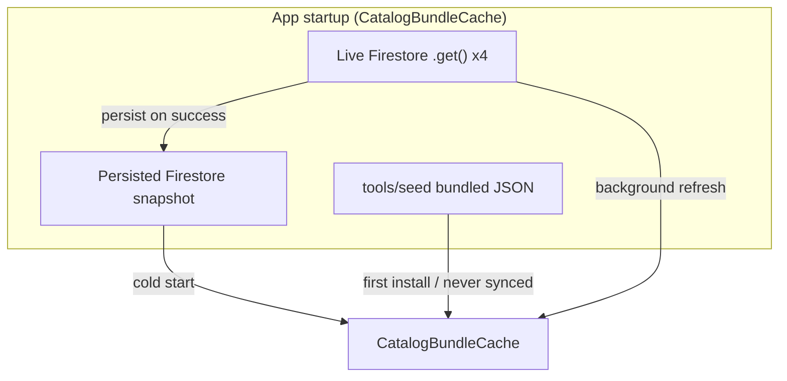
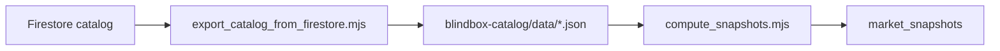
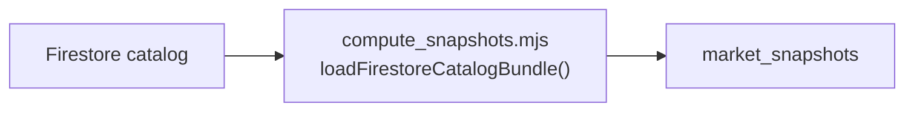
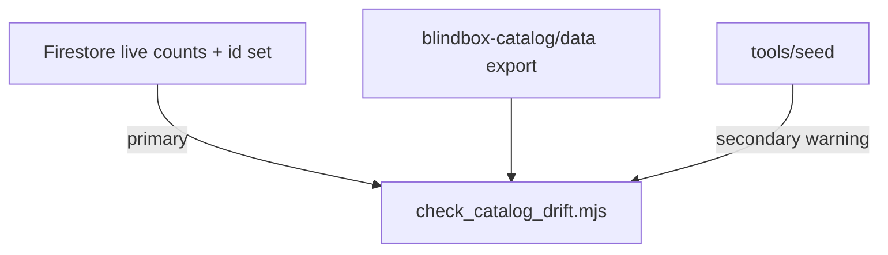
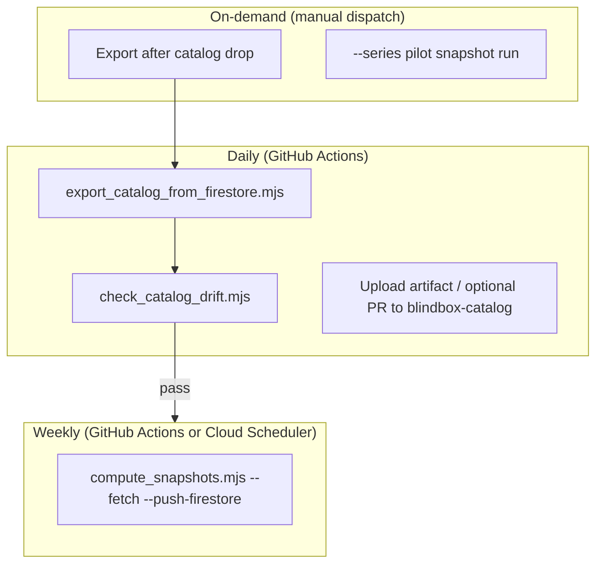
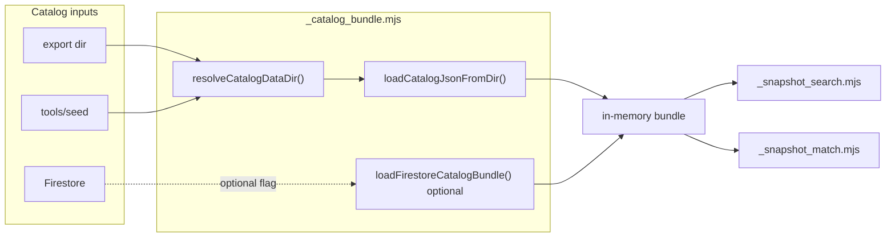
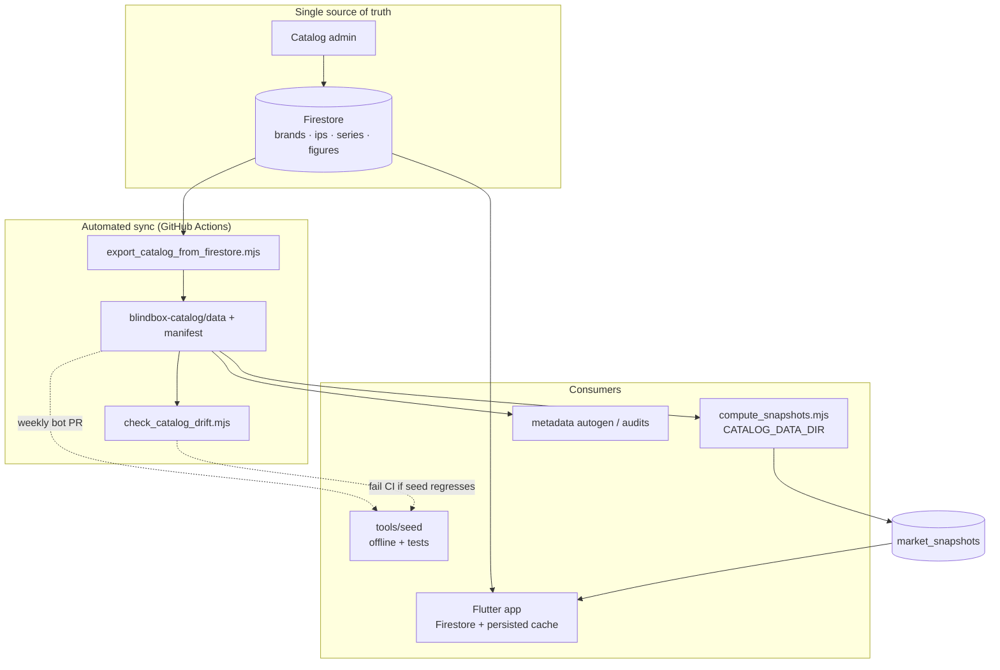

# Sprint 3N-FA — Catalog Export Automation Plan

**Date:** 2026-06-16  
**Type:** Architecture plan only — no implementation, no production behavior changes.  
**Status:** Approved direction for Sprint 3N-FB+ implementation backlog.

---

## Executive summary

Shelfy has **three catalog copies** today with no automated sync:

| Copy | Role today | Authority |
|------|------------|-----------|
| **Firestore** (`brands` / `ips` / `series` / `figures`) | Live app catalog, admin writes | **Authoritative** |
| **`blindbox-catalog/data/*.json`** | Upload source + pipeline target (when `CATALOG_DATA_DIR` set) | **Derived export** |
| **`tools/seed/*.json`** | App offline fallback + Node pipeline default | **Stale snapshot** (~311 figures behind prod) |

**Recommendation:** Treat **Firestore as the single source of truth**. Automate a **Firestore → export → tooling** flow (Option A). Retain `tools/seed` as **test/offline fallback only** until drift detection and export automation are stable, then stop manual seed maintenance.

Measured drift (2026-06-16): production Firestore **~1,457 figures / 154 series** vs `tools/seed` **1,144 / 109** vs `blindbox-catalog/data` **1,455 / 154** (2-figure lag vs live Firestore).

---

## 1. Source of truth

### 1.1 Candidates

| Candidate | What it is | Pros | Cons |
|-----------|------------|------|------|
| **Firestore** | Live `brands`, `ips`, `series`, `figures` collections | App already reads this; admin workflow writes here; always current; drives filters, search, shelf templates, `isBlindBox` for market vocabulary | Requires network + Firebase auth for tooling; not git-friendly |
| **`blindbox-catalog/data`** | JSON export beside admin upload scripts | Same shape as seed; git-committable snapshot; pipeline-friendly; reproducible debugging | **Derived** — drifts when export is manual/stale; separate repo checkout |
| **`tools/seed`** | Bundled JSON in `blindbox_app` | Zero auth offline; fast CI; app first-install fallback | **Not updated** with catalog drops; 311 missing figures; all 18 non-blind-box series absent |

### 1.2 Flutter app behavior



- **Runtime authority:** Firestore (with on-device persistence after first successful sync).
- **Seed role:** First-install / never-synced fallback only — documented in `FIRESTORE_CATALOG_SCHEMA.md` and `CatalogBundleCache`.
- **Export role:** Not read by the app at runtime; supports admin upload workflow and Node tooling.

The app **never** treats `blindbox-catalog/data` or `tools/seed` as more current than Firestore after sync.

### 1.3 Admin workflow

Current implied workflow (from `FIRESTORE_CATALOG_SCHEMA.md` + `blindbox-catalog` README references):

1. Catalog edits land in **Firestore** (console or admin scripts in `blindbox-catalog`).
2. **`blindbox-catalog/data/*.json`** is maintained as the **upload/export mirror** — today **manual**.
3. **`tools/seed`** is occasionally copied for app offline fallback — today **manual and lagging**.

Admin does **not** edit `tools/seed` as primary workflow. Drift is an operational gap, not a product decision.

### 1.4 Market pipeline requirements

Node `loadCatalogBundle()` (`tools/market_intel/_catalog_bundle.mjs`):

| Priority | Source |
|----------|--------|
| 1 | `options.catalogDataDir` |
| 2 | `CATALOG_DATA_DIR` env |
| 3 | `tools/seed` (fallback — warns in `compute_snapshots.mjs`) |

Pipeline needs:

- **Complete figure/series set** for search plans, matcher, Tier B `isBlindBox` joins (Sprint 3N-E).
- **Reproducible input** for debugging failed matches (`--figure`, fixture mode).
- **No live Firestore dependency** on every local dev run (tests, offline audits).

Production runs **must not** default to seed. Sprint 3N-D wired `CATALOG_DATA_DIR`; automation must keep the export fresh.

### 1.5 Offline development requirements

| Need | Solution |
|------|----------|
| App without Firebase | Bundled `tools/seed` (acceptable stale subset) |
| Pipeline unit tests | Fixture JSON dirs / minimal seed subsets |
| Full-catalog pipeline forensics | Committed or CI-cached **export snapshot** |
| Reproducing a production bug | Pin `CATALOG_DATA_DIR` to dated export artifact |

Offline dev does **not** require `tools/seed` to equal production — it requires a **known, versioned export** when fidelity matters.

### 1.6 Final recommendation — source of truth

```
┌─────────────────────────────────────────────────────────┐
│  AUTHORITATIVE: Firestore (brands / ips / series / figures) │
└───────────────────────────┬─────────────────────────────┘
                            │ automated export
                            ▼
┌─────────────────────────────────────────────────────────┐
│  DERIVED: blindbox-catalog/data/*.json (or CI artifact)    │
└───────────────────────────┬─────────────────────────────┘
                            │ CATALOG_DATA_DIR
                            ▼
┌─────────────────────────────────────────────────────────┐
│  CONSUMERS: market pipeline, coverage audits, metadata autogen │
└─────────────────────────────────────────────────────────┘

        tools/seed ──► app offline fallback + test fixtures only
                       (eventually refreshed FROM export, not hand-edited)
```

**Firestore wins.** `blindbox-catalog/data` is the **canonical tooling export**. `tools/seed` is a **degraded offline copy**, not a peer source.

---

## 2. Export architecture

### 2.1 Option A — Firestore → Export Job → `blindbox-catalog/data` → Market Pipeline



### 2.2 Option B — Firestore → Market Pipeline reads Firestore directly



### 2.3 Comparison

| Criterion | Option A (export file) | Option B (direct Firestore) |
|-----------|------------------------|----------------------------|
| **Reliability** | Good — pipeline reads stable snapshot; export failure is explicit | Good — always latest; transient Firestore errors mid-run possible |
| **CI/CD friendliness** | **Excellent** — commit or cache export artifact; no secrets in unit tests | **Poor** — every job needs Firebase credentials + emulator or prod access |
| **Local development** | **Excellent** — point `CATALOG_DATA_DIR` at export; no auth | Requires ADC / service account for every forensics run |
| **Authentication complexity** | **Export job only** needs Admin SDK; pipeline stays file-based | **Every** pipeline invocation needs Admin SDK |
| **Reproducibility** | **Excellent** — hash export manifest; replay exact catalog state | Point-in-time unclear unless export anyway |
| **Snapshot debugging** | **Excellent** — attach `catalog_export_2026-06-16/` to bug reports | Must re-fetch or manually dump |
| **Drift risk** | Export can lag Firestore (hours–days) | **None** between export and read |
| **Coupling** | Loose — same JSON shape as seed/tests | Tight — Node must mirror `firestore_catalog_mapper.dart` forever |

### 2.4 Hybrid (recommended long-term)

- **Default:** Option A for all scheduled and CI runs.
- **Escape hatch:** `--catalog-source firestore` on `compute_snapshots.mjs` for same-day catalog drops or pre-export validation (Option B read path, shared mapper module).
- **Not default:** Direct Firestore on every dev laptop.

### 2.5 Final recommendation — export architecture

**Adopt Option A as the primary architecture.** Add Option B later as an **opt-in flag**, not the default path.

Rationale:

1. Aligns with existing `FIRESTORE_CATALOG_SCHEMA.md` export workflow.
2. Matches Sprint 3N-D `CATALOG_DATA_DIR` wiring already shipped.
3. Preserves offline testability and forensic reproducibility.
4. Centralizes Firebase auth in one export job instead of every pipeline invocation.
5. `push_market_snapshots.mjs` already uses Admin SDK — keeping catalog reads file-based avoids doubling live Firestore load during long snapshot runs.

**Tradeoff accepted:** Export may lag Firestore by up to one export interval. Mitigate with daily export + on-demand dispatch after catalog drops + drift check in CI.

---

## 3. Export script design

**Proposed path:** `tools/catalog/export_catalog_from_firestore.mjs`  
**Not implemented in 3N-FA** — specification only.

### 3.1 Purpose

One-shot read of four Firestore collections, map to seed-compatible JSON, write export files with manifest metadata.

### 3.2 Inputs

| Input | Required | Description |
|-------|----------|-------------|
| `--project-id` | No* | Firebase project (default: `blindbox-collection` or env `FIREBASE_PROJECT_ID`) |
| `--output-dir` | No | Destination directory (default: `../blindbox-catalog/data` relative to repo root, or `CATALOG_EXPORT_DIR` env) |
| `--collections` | No | Default: `brands,ips,series,figures` |
| `--dry-run` | No | Fetch + validate + print counts; do not write |
| `--since` | No | Incremental mode — see §3.6 |
| `GOOGLE_APPLICATION_CREDENTIALS` | Yes (prod) | Same ADC pattern as `push_market_snapshots.mjs` |

\*Required in CI via secret; local dev via `firebase login` / ADC file.

### 3.3 Outputs

```
<output-dir>/
  brands.json
  ips.json
  series.json
  figures.json
  catalog_export_manifest.json   # new — see below
```

**`catalog_export_manifest.json` (proposed):**

```json
{
  "exportedAt": "2026-06-16T14:30:00.000Z",
  "projectId": "blindbox-collection",
  "schemaVersion": 1,
  "counts": {
    "brands": 6,
    "ips": 23,
    "series": 154,
    "figures": 1457
  },
  "skipped": {
    "brands": 0,
    "ips": 0,
    "series": 0,
    "figures": 2
  },
  "contentHash": "sha256:…",
  "source": "firestore",
  "mapperVersion": "firestore_catalog_mapper@2026-06"
}
```

### 3.4 Expected JSON structure

Must match `FIRESTORE_CATALOG_SCHEMA.md` / `tools/seed` shape:

- **Arrays** of objects sorted by canonical `id` (figures, brands, ips).
- **Series** sorted by release date desc (mirror `firestore_catalog_loader.dart` `_compareSeriesSnapshotOrder`).
- **Field names:** camelCase (`brandId`, `ipId`, `seriesId`, `imageKey`, `isBlindBox`, `releaseDate` as `YYYY-MM-DD` string, etc.).
- **Invalid docs:** skipped with stderr log (mirror Dart mapper — missing `imageKey`, required strings).
- **No** Storage URLs, `imagePath`, or download tokens on documents.

**Shared mapper requirement:** Implement `tools/catalog/_firestore_catalog_mapper.mjs` as the Node port of `firestore_catalog_mapper.dart` — single mapping table, tested against Dart golden fixtures.

### 3.5 Failure handling

| Failure | Behavior |
|---------|----------|
| Auth missing / invalid | Exit code `1`; message pointing to `GOOGLE_APPLICATION_CREDENTIALS` / `firebase login` |
| Collection read error | Exit `1`; no partial write (atomic directory replace) |
| Zero figures exported | Exit `1`; likely wrong project or empty collection |
| Mapper rejects >5% of docs | Exit `1`; warn — data quality regression |
| Write permission denied | Exit `1`; preserve previous export (write to temp dir, rename on success) |

**Atomic write pattern:**

1. Write to `<output-dir>.tmp/`
2. Validate JSON parse + manifest counts
3. Rename/swap into `<output-dir>/`

### 3.6 Idempotency

- **Full export (default):** Idempotent — same Firestore state → same sorted JSON → same `contentHash` (deterministic sort + field normalization).
- **Incremental export (phase 2+):** Optional `--since <ISO>` using Firestore `updateTime` or a catalog `catalogRevision` field if added later. **Not required for v1** — four collection `.get()` at ~1.5k docs is cheap enough for daily full export.

### 3.7 Incremental vs full export

| Mode | When | Recommendation |
|------|------|----------------|
| **Full** | v1, daily schedule, post-catalog-drop manual | **Ship first** |
| **Incremental** | >10k figures or rate limits | Defer until scale demands |

---

## 4. Drift detection

**Proposed path:** `tools/catalog/check_catalog_drift.mjs`  
**Not implemented in 3N-FA** — specification only.

### 4.1 What to compare



| Check | Severity | Description |
|-------|----------|-------------|
| **Export vs Firestore** | **Error** (CI) / **Warn** (local) | Document counts per collection; set diff of `id` fields |
| **Export age** | **Warn** | `catalog_export_manifest.exportedAt` older than threshold |
| **Seed vs Export** | **Warn** (local), **Error** (CI on main) | Figure/series count delta; list missing ids (cap at 20) |
| **Orphan refs** | **Error** | Figure `seriesId` not in series export; figure `brandId` not in brands |
| **Required fields** | **Error** | Sample validation on N random figures |

**Do not compare** binary Storage assets in v1 — catalog JSON drift only.

### 4.2 How drift should be reported

**Exit codes:**

| Code | Meaning |
|------|---------|
| `0` | No errors (warnings OK) |
| `1` | Export stale or missing vs Firestore |
| `2` | Seed dangerously behind export (configurable threshold) |
| `3` | Data integrity failure (orphan refs) |

**Human output (stdout):**

```
Catalog drift report — 2026-06-16
──────────────────────────────────
Firestore:  154 series, 1457 figures
Export:     154 series, 1455 figures  ⚠ -2 figures
Seed:       109 series, 1144 figures  ✗ -45 series, -313 figures

Missing from export (vs Firestore): figure_id_a, figure_id_b
Missing from seed (vs export):      mega_crybaby_400_crying_in_pink, …

Export age: 36h (threshold 48h) — OK
Recommendation: run export_catalog_from_firestore.mjs
```

**Machine output:** `--json` flag for CI annotations.

### 4.3 When should CI fail?

| Branch / context | Fail on |
|------------------|---------|
| **`main` / release** | Export vs Firestore count mismatch **if** export artifact is checked in or CI just ran export |
| **`main` PR** | Seed figure count < export − **5%** (regression guard) |
| **Nightly workflow** | Export age > **48h** |
| **Pre-snapshot job** | Export vs Firestore any id mismatch |

**Pragmatic v1:** CI does **not** need live Firestore on every PR. Instead:

1. Nightly job: export → commit or upload artifact → drift check.
2. PR job: compare `tools/seed` counts to **last known manifest** in repo (`tools/catalog/catalog_export_manifest.json` stub or cached artifact).

### 4.4 Recommendation

- Ship `check_catalog_drift.mjs` **after** export script (Phase 3).
- **Fail CI** on seed regression vs pinned manifest on `main`.
- **Warn only** on local dev when seed is stale.
- **Block snapshot pipeline** (pre-step) if export older than 48h or count mismatch vs Firestore when credentials available.

---

## 5. Scheduler strategy

### 5.1 Options evaluated

| Mechanism | Best for | Drawbacks |
|-----------|----------|-----------|
| **GitHub Actions** | Export, drift check, weekly snapshot dry-run | Secrets management; no native Cloud Scheduler integration; minute-level cron OK |
| **Cloud Scheduler + Cloud Run Job** | Production snapshot pushes at scale | More infra; IAM; cost |
| **Manual admin command** | Catalog drops, pilot series | Does not prevent drift |
| **Hybrid** | **Recommended** | Slightly more moving parts |

### 5.2 Recommended hybrid



| Job | Frequency | Mechanism |
|-----|-----------|-----------|
| **Catalog export** | **Daily** 06:00 UTC | GitHub Actions `workflow_dispatch` + cron |
| **Drift validation** | **Immediately after export** | Same workflow step |
| **Seed refresh** | **Weekly** (optional) | Copy export → `tools/seed` via scripted PR (Phase 5) |
| **Snapshot generation** | **Weekly** + manual | GitHub Actions initially; migrate to Cloud Scheduler when sold-data API stable |
| **Alerting** | On failure | GitHub Actions failure notification → email/Slack webhook |

### 5.3 Alerting

| Event | Channel |
|-------|---------|
| Export failed | CI failure + Slack |
| Drift detected (nightly) | Slack warn with missing id sample |
| Snapshot push failed | CI failure + pager for prod |
| Export age > 72h | Weekly digest |

### 5.4 Recommendation

**Start with GitHub Actions only** for export + drift (lowest infra). Introduce **Cloud Scheduler** for snapshot pushes when Marketplace Insights is live and runtime exceeds GHA limits (~6h). Keep **manual dispatch** for catalog drops and pilot series.

---

## 6. Market snapshot pipeline integration

### 6.1 Current state (post Sprint 3N-D)

```
compute_snapshots.mjs
  → loadCatalogBundle()
  → resolveCatalogDataDir()
       1. options.catalogDataDir
       2. CATALOG_DATA_DIR
       3. tools/seed  ⚠ warns on seed_fallback
```

### 6.2 Target state

```
compute_snapshots.mjs
  → loadCatalogBundle()
  → resolveCatalogDataDir()
       1. options.catalogDataDir
       2. CATALOG_DATA_DIR  ← points at fresh export
       3. tools/seed  ← test/offline only; warn loudly

Optional (Phase 4+):
  → --catalog-source firestore
  → loadFirestoreCatalogBundle()  // shared mapper
```



### 6.3 Should `tools/seed` remain supported?

| Phase | Policy |
|-------|--------|
| **Now → Phase 4** | **Yes** — fallback for offline app + unset `CATALOG_DATA_DIR`; pipeline warns on use |
| **Phase 5** | **Test-only** — retained for `flutter test`, fixture dirs, first-install simulation; **not** for production pipeline |
| **Never** | Delete seed entirely — app offline story still needs bundled JSON |

### 6.4 Should seed become test-only?

**Yes, as a pipeline input** — not as an app bundle.

- **App:** seed remains bundled fallback until app loads persisted Firestore snapshot.
- **Pipeline:** production commands **require** `CATALOG_DATA_DIR` or explicit export path; seed fallback returns exit code `1` in CI mode (`CATALOG_STRICT=1`).

### 6.5 `blindbox-catalog` repo relationship

Two valid layouts:

| Layout | Pros |
|--------|------|
| **A. Export writes to sibling `../blindbox-catalog/data`** | Matches admin upload repo; single checkout for ops |
| **B. Export writes to `blindbox_app/catalog_export/` artifact** | Self-contained CI; blindbox-catalog pulls artifact |

**Recommendation:** **Layout A** for admin ergonomics; CI uploads manifest + artifact either way. Document required checkout layout in `tools/catalog/README.md` (future).

### 6.6 Metadata autogen

`tools/market_intel/market_metadata.json` and `METADATA_AUTOGEN_DESIGN.md` currently reference seed inputs. Future autogen should read **`CATALOG_DATA_DIR` export**, not seed.

---

## 7. Migration plan

### Phase 1 — Plan (Sprint 3N-FA) ✅

| Item | Effort | Risk |
|------|--------|------|
| This document | 0.5d | None |
| Align with `MARKET_PIPELINE_ALIGNMENT_PLAN.md` | — | None |

**Deliverable:** Approved architecture, no code.

---

### Phase 2 — Export script (Sprint 3N-FB)

| Item | Effort | Risk |
|------|--------|------|
| `tools/catalog/_firestore_catalog_mapper.mjs` | 1d | **Medium** — mapper parity with Dart |
| `export_catalog_from_firestore.mjs` | 1d | Low |
| Golden tests (Dart export sample ↔ Node) | 0.5d | Low |
| `tools/catalog/README.md` ops guide | 0.25d | None |

**Exit criteria:**

- One manual export matches Firestore counts within skipped-doc tolerance.
- Manifest written; deterministic re-run hash stable.

**Risk:** Mapper drift between Dart and Node — mitigate with shared fixture JSON tests.

---

### Phase 3 — Drift detection (Sprint 3N-FC)

| Item | Effort | Risk |
|------|--------|------|
| `check_catalog_drift.mjs` | 1d | Low |
| Pin `catalog_export_manifest.json` in repo or CI cache | 0.25d | Low |
| PR check: seed vs manifest threshold | 0.5d | Low |

**Exit criteria:**

- Nightly drift report green after export.
- Seed regression fails CI on `main`.

**Risk:** False positives if Firestore edited mid-export — use atomic export window.

---

### Phase 4 — Automation (Sprint 3N-FD)

| Item | Effort | Risk |
|------|--------|------|
| GitHub Action: daily export + drift | 1d | **Medium** — secrets |
| `workflow_dispatch` for on-demand export | 0.25d | Low |
| Pre-snapshot export gate in weekly job | 0.5d | Low |
| Optional `--catalog-source firestore` | 1d | Medium |

**Exit criteria:**

- Export runs daily without human intervention.
- `CATALOG_DATA_DIR` in snapshot workflow always points at fresh artifact.

**Risk:** Credential rotation — document `GOOGLE_APPLICATION_CREDENTIALS` in org secrets.

---

### Phase 5 — Reduce seed dependency (Sprint 3N-FE)

| Item | Effort | Risk |
|------|--------|------|
| `CATALOG_STRICT=1` fails pipeline on seed fallback | 0.25d | Low |
| Weekly PR: refresh `tools/seed` from export (bot) | 1d | **Medium** — large JSON diffs |
| Remove seed references from market intel docs | 0.5d | None |
| Deprecate hand-editing seed in contributor docs | 0.25d | None |

**Exit criteria:**

- No production ops doc mentions seed as catalog source.
- Seed figure count within 0% of export (automated refresh).
- Pipeline CI never reads seed.

**Risk:** Large seed PRs — use weekly bot PR, not per-commit.

---

### Effort summary

| Phase | Calendar | Cumulative effort |
|-------|----------|-------------------|
| 1 Plan | 3N-FA | 0.5d |
| 2 Export | 3N-FB | ~2.75d |
| 3 Drift | 3N-FC | ~1.75d |
| 4 Automation | 3N-FD | ~2.75d |
| 5 Seed deprecation | 3N-FE | ~2d |
| **Total** | ~5 sprints | **~9.75 dev-days** |

### Risk register

| Risk | Likelihood | Impact | Mitigation |
|------|------------|--------|------------|
| Mapper Dart/Node mismatch | Medium | High | Golden tests, shared schema doc |
| Export stale at snapshot run | Medium | Medium | Pre-step drift gate; manifest age check |
| CI secret exposure | Low | High | Read-only service account; minimal scopes |
| Large seed refresh PRs | High | Low | Weekly bot; avoid manual merge conflicts |
| blindbox-catalog repo not checked out | Medium | Low | Clear README; fallback env path |

---

## 8. Tradeoffs summary

| Decision | Chosen | Rejected alternative | Why |
|----------|--------|----------------------|-----|
| Source of truth | Firestore | seed or export | App + admin already on Firestore |
| Pipeline catalog input | Export file (A) | Direct Firestore (B) | CI, reproducibility, auth isolation |
| Export location | `blindbox-catalog/data` | Only in-repo artifact | Matches upload workflow |
| Incremental export | Defer | Ship day one | <2k docs; simplicity |
| Seed fate | Test/offline fallback | Delete | App first-install still needs bundle |
| Scheduler | GitHub Actions first | Cloud-only | Lower infra; team already on GitHub |

---

## 9. Final recommendation

1. **Firestore** is the **only authoritative catalog**. Everything else is derived.
2. **Automate Option A:** `export_catalog_from_firestore.mjs` → `blindbox-catalog/data` → `CATALOG_DATA_DIR` → market pipeline.
3. **Add drift detection** before relying on export in scheduled snapshot jobs.
4. **Schedule daily export + drift** via GitHub Actions; weekly snapshot job gated on fresh export.
5. **Retire seed as a pipeline input** over Phase 5; keep seed as **app offline / test fixture** refreshed from export.
6. **Defer direct Firestore pipeline reads** to an opt-in `--catalog-source firestore` flag for ops emergencies only.

This closes the drift that caused the market pipeline to miss **311 figures and all 18 non-blind-box series** when `CATALOG_DATA_DIR` was unset, without changing Flutter runtime behavior or Firestore schema.

---

## 10. Related documents

| Document | Relationship |
|----------|--------------|
| `lib/features/catalog/firestore/FIRESTORE_CATALOG_SCHEMA.md` | Schema contract for export |
| `tools/market_intel/MARKET_PIPELINE_ALIGNMENT_PLAN.md` | Sprint 3N-D precursor; P0 `CATALOG_DATA_DIR` shipped |
| `tools/market_intel/MARKET_SNAPSHOT_PIPELINE_FORENSICS.md` | Root-cause evidence for seed drift |
| `tools/market_intel/_catalog_bundle.mjs` | Current loader — export consumer |
| `.cursor/ARCHITECTURE.md` | Catalog universe boundaries |

---

## Appendix A — End-state diagram



## Appendix B — Production runbook (target)

```bash
# 1. Export (daily automated; manual after catalog drop)
node tools/catalog/export_catalog_from_firestore.mjs \
  --output-dir ../blindbox-catalog/data

# 2. Verify drift
node tools/catalog/check_catalog_drift.mjs \
  --export-dir ../blindbox-catalog/data

# 3. Snapshot pipeline (weekly or pilot)
CATALOG_DATA_DIR=../blindbox-catalog/data \
  node tools/market_intel/compute_snapshots.mjs --fetch --push-firestore --limit 50
```

*Scripts above are specified but not implemented in Sprint 3N-FA.*
