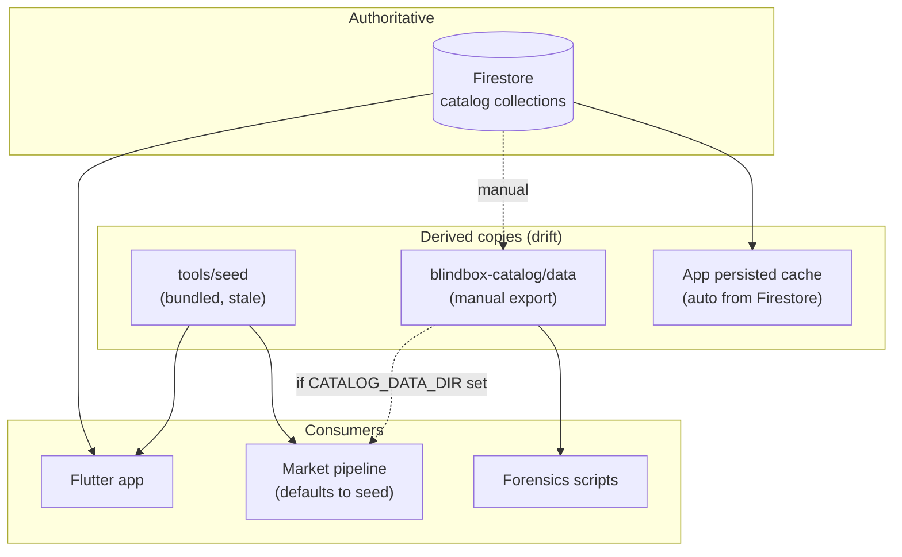
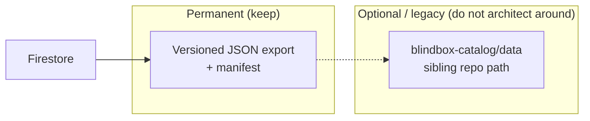
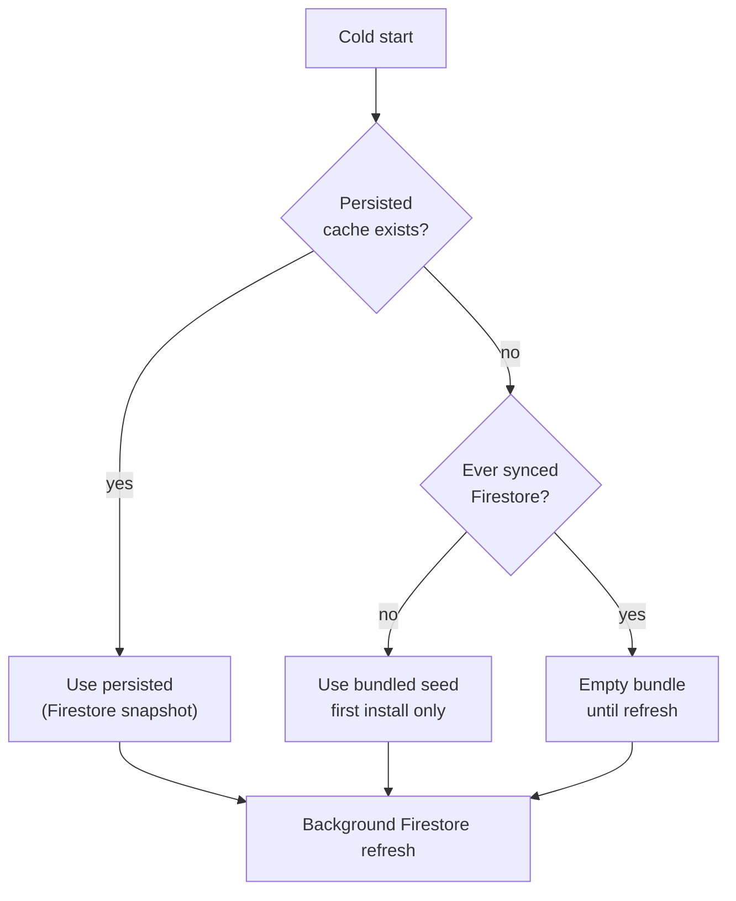
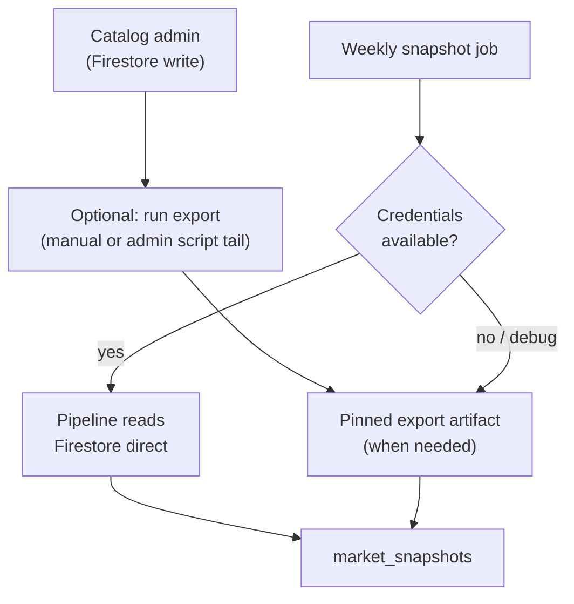
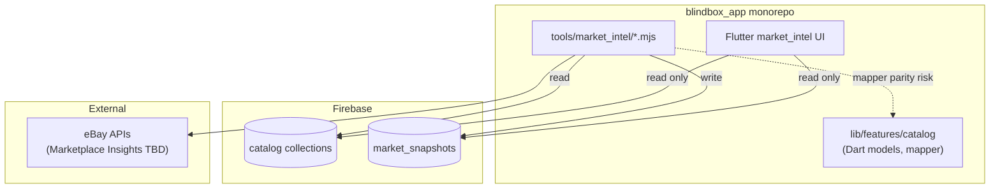
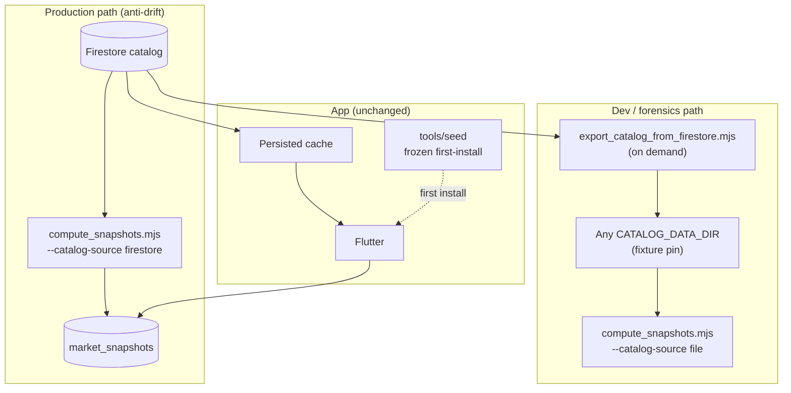
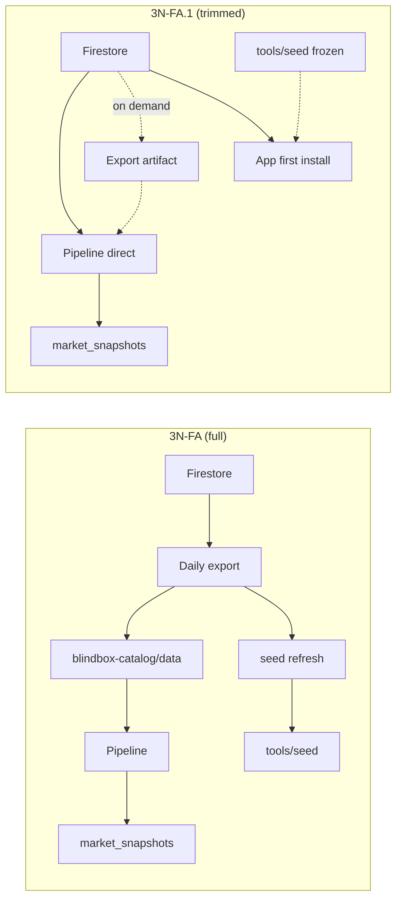

# Sprint 3N-FA.1 — Catalog + Market Data Architecture Review

**Date:** 2026-06-16  
**Type:** Architecture review only — challenges Sprint 3N-FA before 3N-FB implementation.  
**Constraints:** No code, scripts, commits, workflows, schema, or production behavior changes.

**Related:** [`tools/catalog/CATALOG_EXPORT_AUTOMATION_PLAN.md`](../catalog/CATALOG_EXPORT_AUTOMATION_PLAN.md) (3N-FA plan under review)

---

## Executive summary

Sprint 3N-FA correctly identified **Firestore drift** as the root problem and correctly demoted `tools/seed` as non-authoritative. However, parts of the proposed solution **over-build infrastructure**:

| 3N-FA proposal | FA.1 verdict |
|----------------|--------------|
| Firestore is authoritative | **Keep** |
| `blindbox-catalog/data` as permanent sync hub | **Trim** — export *format* is valuable; sibling-repo coupling is optional |
| Daily scheduled export | **Reject** — episodic catalog changes do not justify daily jobs |
| Weekly seed refresh from export | **Remove from roadmap** — app no longer depends on seed freshness |
| Full drift detection across 3 copies | **Narrow** — one gate: pipeline input vs Firestore |
| Export before every pipeline category of work | **Simplify** — direct Firestore for scheduled prod; export on demand for debug |

**Revised simplest viable architecture:**

```text
AUTHORITATIVE: Firestore (brands / ips / series / figures)

PRODUCTION PIPELINE (scheduled / CI with credentials):
  Firestore ──direct read──► compute_snapshots.mjs ──► market_snapshots

LOCAL DEV / FORENSICS / REPRO BUGS (no credentials required):
  Firestore ──on-demand export──► pinned JSON dir ──► CATALOG_DATA_DIR

APP (unchanged):
  Firestore ──► persisted on-device cache ──► Flutter
  tools/seed ──► first-install only (frozen, not refreshed)

REMOVED FROM ROADMAP:
  Export → tools/seed automation
  Daily export cron
  Mandatory blindbox-catalog checkout for pipeline
```

**3N-FB scope recommendation:** Ship a **small export utility** and **direct Firestore catalog loader** for the pipeline. Defer daily automation, seed refresh, and blindbox-catalog repo coupling.

---

## Current state (baseline)



**Measured drift (2026-06-16):**

| Copy | Figures | Series | Notes |
|------|--------:|-------:|-------|
| Firestore (live) | ~1,457 | 154 | App + admin truth |
| `blindbox-catalog/data` | 1,455 | 154 | 2-figure lag |
| `tools/seed` | 1,144 | 109 | Pipeline default when env unset |

**Actual failure mode:** Market pipeline silently used seed → **311 invisible figures**, including all 18 non-blind-box series. Sprint 3N-D fixed the *wiring* (`CATALOG_DATA_DIR`); automation plan risk is building ops around the wrong intermediate layer.

---

# Question 1 — Is `blindbox-catalog/data` a permanent architecture layer?

## Options restated

| | Option A — Permanent layer | Option B — Temporary compatibility |
|---|---------------------------|----------------------------------|
| Flow | Firestore → Export → `blindbox-catalog/data` → Pipeline | Firestore → Pipeline (export only when needed) |
| `blindbox-catalog/data` | Always the tooling catalog input | Legacy admin path; eventually unused by pipeline |

## Analysis

### Operational benefits (Option A)

| Benefit | Real? | Notes |
|---------|-------|-------|
| Decouples pipeline from live Firestore | Yes | Valuable during long snapshot runs (~hours) |
| Single checkout for admin + pipeline | Partial | Requires sibling repo; friction on CI |
| Human-inspectable catalog dump | Yes | JSON diffable in PRs |
| Upload workflow mirror | **Legacy** | Schema doc says export is "for upload" — implies **Firestore ← JSON** admin path may still exist in `blindbox-catalog` |

### Debugging benefits

Export snapshots are **genuinely valuable** for:

- Attaching exact catalog state to matcher bug reports
- Re-running `compute_snapshots --figure X` without Firebase
- CI fixture pins (`catalog_export_2026-06-16/`)

These benefits attach to the **export artifact pattern**, not specifically to the path `../blindbox-catalog/data`.

### Reproducibility

| Approach | Reproducibility |
|----------|-----------------|
| Pinned export dir + manifest hash | **Excellent** |
| Live Firestore at run time | **Poor** — catalog may change mid-batch |
| `tools/seed` | **Frozen wrong** — reproducible but wrong |

**Conclusion:** Reproducibility requires **versioned export artifacts**, not necessarily a standing directory in a second repo.

### Local development

Developers need:

1. **Fast unit tests** — tiny fixture JSON (already exists under `tools/market_intel/fixtures/`)
2. **Full-catalog forensics** — production export snapshot (once per investigation, not daily)
3. **No Firebase on laptop** — pinned export or seed subset

Local dev does **not** require a continuously synced `blindbox-catalog/data`.

### Maintenance cost

| Cost driver | Option A (standing layer) | Option B (on-demand) |
|-------------|---------------------------|----------------------|
| Second repo checkout | Required today | Optional |
| Daily export job | High ops surface | None |
| Drift between export and Firestore | Ongoing monitoring | Only matters for pinned artifacts |
| Mapper parity (Dart + Node) | Required either way | Required either way |

### Future scaling

At ~1.5k figures, full collection `.get()` is trivial. Export remains cheap until **10k+** figures or subcollection hierarchies appear (not planned per `FIRESTORE_CATALOG_SCHEMA.md`).

At scale, **event-sourced incremental export** might matter — not a reason to cement `blindbox-catalog/data` today.

## Recommendation — Question 1

**Split the concept:**



| Layer | Verdict |
|-------|---------|
| **Export artifact** (4 JSON files + manifest) | **Permanent** — debugging, CI pins, offline forensics |
| **`blindbox-catalog/data` as canonical path** | **Semi-temporary** — convenience for admin upload repo; not required long-term |
| **Pipeline always reads export file** | **Not permanent** — production scheduled runs should prefer **direct Firestore** |

**Answer:** Neither pure Option A nor pure Option B. **Permanent:** export-on-demand as a *pattern*. **Temporary:** treating `blindbox-catalog/data` as the mandatory hub between Firestore and all tooling.

---

# Question 2 — Who actually consumes exports?

## Consumer audit

| Consumer | Real today? | Required long term? | Verdict |
|----------|-------------|---------------------|---------|
| **1. Market Snapshot Pipeline** | Yes — when `CATALOG_DATA_DIR` set | Needs **current catalog**; not necessarily export *file* | **Keep consumer**; allow Firestore direct in prod |
| **2. `blindbox-catalog` repository** | Yes — manual export/upload workflow per schema doc | **Unclear** — if admin writes Firestore directly, JSON may be export-only | **Do not block pipeline on this repo** |
| **3. `tools/seed` refresh** | No automation today | **No** — see below | **Remove from roadmap** |
| **4. Future analytics** | No | Maybe | **Optional** — same export utility suffices |
| **5. Forensics scripts** (`_sprint_3nc_*.mjs`, coverage audits) | Yes — hardcoded `blindbox-catalog` paths | Yes for offline audits | **Point at any export dir** |
| **6. Flutter app** | **No** — never reads export | No | **N/A** |
| **7. `METADATA_AUTOGEN_DESIGN.md`** | References seed | Should read export or Firestore | **Update when implemented** |

## Deep dive — Market Snapshot Pipeline

```text
tools/market_intel/_catalog_bundle.mjs
  → resolveCatalogDataDir() → CATALOG_DATA_DIR | tools/seed
```

- **Real consumer:** yes.
- **Requires export layer permanently?** **No** — requires **catalog parity with Firestore**. File or direct read are implementation choices.

## Deep dive — `blindbox-catalog` repository

Documented as "Firestore upload source" — suggests historical flow:

```text
JSON in blindbox-catalog → upload scripts → Firestore
```

If admin workflow has moved to **Firestore-first** (console / Admin SDK), the repo is a **mirror**, not a source. Pipeline coupling to it creates **false authority** (export can lag Firestore by 2+ figures today).

**Recommendation:** Treat `blindbox-catalog` as an **admin convenience**, not an architecture pillar. Pipeline `CATALOG_DATA_DIR` should accept **any** directory, including `blindbox_app/.catalog_export/` or CI artifacts.

## Deep dive — Seed refresh (`Export → tools/seed`)

### App catalog loading today



From `CatalogBundlePersistence`:

> Once `markFirestoreSyncCompleted` is set, startup must not fall back to the bundled seed — only to this persisted bundle.

**Implications:**

| Scenario | Seed freshness matters? |
|----------|-------------------------|
| First install, offline | Yes — user sees stale subset (~1,144 figures) until online |
| Normal user (synced once) | **No** — persisted Firestore snapshot is used |
| Developer `flutter test` | Uses mocks / `CatalogBundleCache.prime` — not bundled seed counts |
| Pipeline | Should **never** use seed in prod |

### Does seed refresh provide meaningful value?

| Claimed benefit | Assessment |
|-----------------|------------|
| Better first-install offline experience | Marginal — seed is still incomplete vs Firestore; persisted cache replaces it after one sync |
| Keeps pipeline aligned | **Wrong tool** — pipeline should not read seed |
| Reduces drift anxiety | Creates **large noisy PRs** (~300+ figure JSON diffs weekly) for little user impact |
| Test realism | Tests should use **minimal fixtures**, not full prod clone in `pubspec` assets |

**Recommendation:** **Remove seed refresh from the roadmap entirely.**

Retain `tools/seed` as:

- **Frozen first-install bootstrap** (update manually only on major app release if desired)
- **Small pipeline test fixtures** (subset copies in `tools/market_intel/fixtures/`, not full seed sync)

Do **not** automate `Export → tools/seed`.

---

# Question 3 — Daily export vs event-driven export

## Options

| | Option A — Daily scheduled | Option B — Event-driven | Option C — Hybrid |
|---|---------------------------|-------------------------|-------------------|
| Trigger | Cron 06:00 UTC | After catalog admin write | On-demand + pre-job gate |
| Drift window | Up to 24h | Minutes | Bounded by last export age at job start |
| Cost | 365 exports/year | ~10–30/year (catalog drop frequency) | ~10–30 + manual |
| Complexity | Scheduler + alerting | Hook in admin workflow | Light script + manual dispatch |

## Catalog change frequency (reality check)

- **154 series, ~1,457 figures** — catalog grows in **bursts** (IP launches), not continuously.
- Observed admin pattern: episodic drops, not daily edits.
- Market snapshots target **weekly** refresh (3N-FA) — daily catalog export is **faster than downstream consumers need**.

## Cost analysis

| Resource | Daily export | Event / hybrid |
|----------|--------------|----------------|
| Firestore reads | 4 × `.get()` × 365 ≈ 1,460 full scans/year | ~4 scans per catalog event |
| GitHub Actions | 365 min/year + secrets | ~10–30 runs/year |
| Human attention | Daily failure alerts (noise) | Alerts tied to real catalog work |
| Drift risk | Export stale up to 24h before weekly snapshot | Export stale only if admin skips hook |

## Reliability & recovery

| Failure | Daily | Event-driven |
|---------|-------|--------------|
| Export job fails | Pipeline runs on 24h-old export; silent drift | Next catalog change blocked or warned |
| Admin forgets to export | Max 24h stale | Stale until next event — **but** direct Firestore pipeline bypasses this |
| Firestore outage | Export fails; same as pipeline direct read | Same |

**Event-driven weakness:** Requires discipline or automation at catalog write time. Mitigation: **production pipeline reads Firestore directly** — export is for humans and debug, not the critical path.

## Recommendation — Question 3

**Reject daily export as default.**

**Adopt Option C (hybrid), trimmed:**



| When | Action |
|------|--------|
| **After catalog drop** | Manual or scripted `export_catalog_from_firestore.mjs` (admin habit) |
| **Before weekly snapshot** | Pipeline uses **direct Firestore** — no export prerequisite |
| **Debugging** | Export on demand; pin `CATALOG_DATA_DIR` |
| **CI unit tests** | Fixture dirs only — no export |

**Do not schedule daily export** until catalog change frequency or compliance needs justify it.

---

# Question 4 — Is Market Snapshot becoming a separate service?

## Current coupling



| Coupling type | Strength | Notes |
|---------------|----------|-------|
| **Data** | Loose | App reads `market_snapshots`; pipeline writes. No shared runtime. |
| **Code** | Medium | Node pipeline in same repo; mapper must mirror Dart |
| **Deploy** | **Independent already** | Pipeline is CLI + GHA; app is app store |
| **Catalog identity** | Tight conceptual | Matcher/search terms derive from catalog fields (`isBlindBox`, aliases) |
| **Firebase project** | Shared | Same project for catalog + snapshots |

## Trajectory assessment

**Likely direction (12–24 months):**

```text
Today:     CLI in repo + manual/GHA trigger
Near:      Cloud Run Job / Cloud Scheduler running same container
Later:     Logically separate "Market Data" workload — possibly separate repo
Unlikely:  Immediate split before Marketplace Insights pilot proves ops model
```

**Forces pushing separation:**

| Force | Weight |
|-------|--------|
| Long-running batch jobs (full catalog × eBay quota) | High |
| Different cadence (weekly compute vs app releases) | High |
| Marketplace Insights credentials & rate limits | Medium |
| Team ownership split (data vs mobile) | Low today |
| Mapper duplication pain (Dart/Node) | Medium — argues for **shared schema package**, not necessarily repo split |

**Forces keeping monorepo:**

| Force | Weight |
|-------|--------|
| Single PR for schema + mapper + UI (Tier B vocabulary) | High |
| Small team | High |
| Pipeline tests colocated with `firestore_catalog_mapper.dart` | Medium |

## Marketplace Insights integration

Sold-data fetch is **the** scaling bottleneck — not catalog export. Insights integration implies:

- Longer job duration
- Secret management outside developer laptops
- Retry/backoff policies
- Possibly per-IP rotation

That profile fits **Cloud Run Job** or **Cloud Functions Gen2 batch** better than developer CLI — regardless of repo layout.

## Recommendation — Question 4

**Direction:** Market snapshot generation is **already a separate logical service**; it will **physically migrate** to a scheduled backend workload before it moves to a separate repository.

| Milestone | Action |
|-----------|--------|
| **Now** | Keep `tools/market_intel/` in monorepo |
| **Post-Insights pilot** | Containerize pipeline; Cloud Scheduler trigger |
| **Later** | Extract repo only if mobile and data teams diverge or job code dwarfs app |

**Do not** split repos in 3N-FB. **Do** design export/Firestore loaders as **standalone modules** that could move with the pipeline.

---

# Question 5 — Simplest architecture that still solves drift

## Problem restated

```text
Prevent catalog drift between Firestore and Market Snapshot tooling.
```

Not: "maintain three synchronized JSON copies."

## Alternatives compared

| Architecture | Solves drift? | Complexity | Reproducibility | Offline dev |
|--------------|---------------|------------|-----------------|-------------|
| **A. Status quo + `CATALOG_DATA_DIR` manual** | Partial | Low | Good if dir pinned | Good |
| **B. 3N-FA full: daily export → blindbox-catalog → pipeline** | Yes | **High** | Excellent | Good |
| **C. Firestore → pipeline direct (prod)** | **Yes** | **Lowest** | Poor unless export pinned | Needs ADC |
| **D. On-demand export only** | Yes | Low | Excellent when exported | Good |
| **E. C + D hybrid (recommended)** | **Yes** | **Low–medium** | Best of both | Good |

## Could `Firestore → Pipeline` be sufficient?

**Yes, for production scheduled runs.**

```text
compute_snapshots.mjs --catalog-source firestore
  → loadFirestoreCatalogBundle()  // Node port of firestore_catalog_loader.dart
  → always matches live Firestore
```

Requirements:

- Firebase Admin credentials in CI/Cloud Run (already needed for `push_market_snapshots.mjs`)
- Mapper parity tests (one-time cost)
- Stable catalog during multi-hour runs (snapshot at start of run — same as export file)

**Drift impossible** between pipeline input and Firestore for that run.

## Could export be on-demand only?

**Yes.**

Export is needed when:

- Developer lacks credentials
- Forensics requires attachable artifact
- CI unit tests use pinned fixture

Export is **not** needed on every production snapshot cycle if pipeline reads Firestore directly.

## Simplest viable architecture (recommended)



### What to cut from 3N-FA

| Remove / defer | Why |
|----------------|-----|
| Daily export schedule | Overkill for catalog cadence |
| `Export → tools/seed` Phase 5 | App uses persisted cache; seed refresh is noise |
| Mandatory `blindbox-catalog` checkout | Path-agnostic `CATALOG_DATA_DIR` |
| Drift check across 3 copies | Single check: file export vs Firestore **when export is used** |
| Standing "sync hub" mental model | Firestore is hub; export is optional artifact |

### What to keep from 3N-FA

| Keep | Why |
|------|-----|
| `export_catalog_from_firestore.mjs` | Debug, fixtures, admin habit |
| Shared Node mapper | Required for direct Firestore path too |
| `CATALOG_STRICT=1` | Fail pipeline if falling back to seed in CI |
| Manifest + content hash | Reproducible pins |
| Pre-flight count log | `figures: 1457` vs `1144` obvious warning |

### Minimal 3N-FB scope (revised)

| Deliverable | Effort | Priority |
|-------------|--------|----------|
| `loadFirestoreCatalogBundle()` in Node | 1.5d | **P0** |
| `--catalog-source firestore\|file` on pipeline | 0.5d | **P0** |
| `export_catalog_from_firestore.mjs` | 1d | **P1** |
| `check_catalog_drift.mjs` (export vs Firestore only) | 0.5d | **P2** |
| GHA: weekly snapshot with `firestore` source | 1d | **P2** |
| Daily export GHA | — | **Deferred** |
| Seed refresh bot | — | **Cancelled** |

**Total revised effort:** ~4.5 dev-days vs ~9.75 in 3N-FA full plan.

---

# Tradeoffs summary

| Decision | Choose | Sacrifice |
|----------|--------|-----------|
| Prod pipeline reads Firestore | Zero catalog drift in prod | Requires credentials everywhere pipeline runs |
| Export on demand | Lower ops burden | Manual step for offline forensics |
| No seed refresh | Smaller PRs, clearer roles | First-install offline catalog stays stale until sync |
| Monorepo pipeline | Faster schema/UI iteration | Later extraction work if team splits |
| No daily export | Less CI noise | Export may lag until admin runs it (irrelevant if prod uses Firestore) |

---

# Risks

| Risk | Likelihood | Impact | Mitigation |
|------|------------|--------|------------|
| Dart/Node mapper drift | Medium | High | Golden fixture tests in 3N-FB |
| Long pipeline run sees catalog mutation | Low | Medium | Snapshot bundle at job start; log `catalogCapturedAt` |
| Developers default to seed | Medium | High | `CATALOG_STRICT=1` in CI; loud warning in CLI |
| Over-engineering before Insights pilot | **High** | Medium | **This review** — trim 3N-FB |
| `blindbox-catalog` repo confusion | Medium | Low | Document: not pipeline dependency |
| Cloud Run migration duplicates work | Low | Medium | Module boundaries in `tools/catalog/` |

---

# Final recommendation

## 1. Source of truth (unchanged)

**Firestore** is authoritative. Everything else is derived or frozen.

## 2. `blindbox-catalog/data` (revised)

- **Not** a permanent mandatory architecture layer.
- **Export JSON pattern** is permanent for debug/CI pins.
- Default prod pipeline path: **Firestore direct**.
- `blindbox-catalog/data` remains a **valid optional output path** for admin convenience.

## 3. Consumers (revised)

| Consumer | Action |
|----------|--------|
| Market pipeline | **Firestore direct (prod)** + file (dev) |
| `blindbox-catalog` repo | Decouple from pipeline requirements |
| Seed refresh | **Remove from roadmap** |
| Analytics | Reuse export utility when needed |

## 4. Export schedule (revised)

**Hybrid on-demand** — export after catalog drops and for forensics. **No daily cron.**

## 5. Market snapshot service trajectory

Stay in monorepo; plan for **containerized scheduled workload** post-Insights. Separate repo only if org structure demands it.

## 6. Simplest anti-drift architecture

```text
PRODUCTION:
  Firestore ──► Market Pipeline ──► market_snapshots
  (no standing export layer required)

DEVELOPMENT:
  Firestore ──on-demand──► export dir ──► CATALOG_DATA_DIR
  OR tiny fixtures in tests

APP:
  Firestore ──► persisted cache (unchanged)
  tools/seed = frozen first-install bootstrap only

GUARDRAILS:
  CATALOG_STRICT=1 in CI
  seed fallback never in production jobs
```

## 7. Sprint 3N-FB gate

**Proceed with 3N-FB** using the **trimmed scope** above. Do **not** implement daily export, seed refresh automation, or blindbox-catalog coupling as architectural requirements.

Update [`CATALOG_EXPORT_AUTOMATION_PLAN.md`](../catalog/CATALOG_EXPORT_AUTOMATION_PLAN.md) after approval to reflect FA.1 decisions before coding.

---

## Appendix A — Architecture comparison diagram



## Appendix B — Decision log

| ID | Question | 3N-FA answer | FA.1 answer |
|----|----------|--------------|-------------|
| D1 | Permanent export layer? | Yes, `blindbox-catalog/data` | Export *pattern* yes; repo path no |
| D2 | Seed refresh? | Phase 5 weekly bot | **Cancelled** |
| D3 | Export frequency? | Daily | **On-demand + post catalog drop** |
| D4 | Separate service? | Not addressed | Logical separation now; physical later |
| D5 | Simplest fix? | Export automation stack | **Firestore-direct prod pipeline** |

## Appendix C — References

| Document | Relevance |
|----------|-----------|
| `lib/features/catalog/firestore/FIRESTORE_CATALOG_SCHEMA.md` | Schema contract |
| `lib/features/catalog/application/catalog_bundle_cache.dart` | Persisted cache > seed |
| `lib/features/catalog/data/catalog_bundle_persistence.dart` | No seed after first sync |
| `tools/market_intel/_catalog_bundle.mjs` | Current file-based loader |
| `tools/catalog/CATALOG_EXPORT_AUTOMATION_PLAN.md` | Plan under review |
| `tools/market_intel/MARKET_SNAPSHOT_PIPELINE_FORENSICS.md` | Drift evidence |
