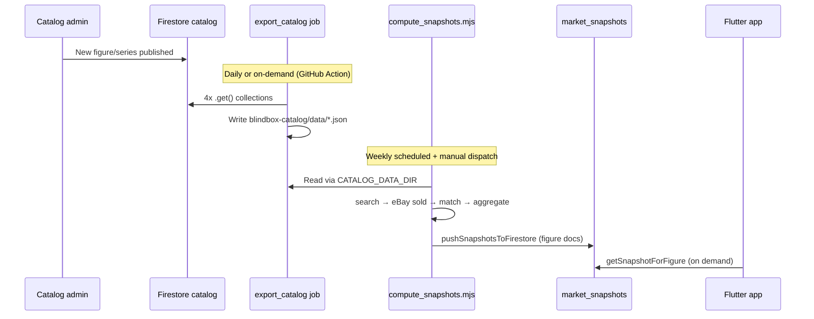

# Sprint 3N-D — Production Catalog Alignment & Implementation Plan

**Date:** 2026-06-16  
**Type:** Architecture correction + implementation backlog (not a coverage audit).  
**Status:** P0 catalog wiring **started** in `_catalog_bundle.mjs` (`CATALOG_DATA_DIR`).

---

## Architectural correction

Shelfy's catalog source of truth:

```
Firestore (brands / ips / series / figures)
  → CatalogBundleCache
  → App
```

`tools/seed/` is documented as **offline dev fallback**, not canonical catalog:

```88:90:lib/features/catalog/firestore/FIRESTORE_CATALOG_SCHEMA.md
- Canonical export for upload + offline dev: `D:\blindbox-catalog\data\{brands,ips,series,figures}.json` (keep in sync with Firestore).
- App fallback copies live under `tools/seed/*.json` (same shape; currently ~6 brands, ~23 IPs, ~110 series, ~1151 figures).
- `loadCatalogBundle()` loads Firestore first, then `tools/seed/` on failure.
```

The **Node market pipeline** had a parallel function name (`loadCatalogBundle`) that **only** read `tools/seed/`. That is an implementation drift from app architecture — not a product decision that seed is authoritative for market intelligence.

**First question answered:** The pipeline reads a secondary data source because Sprint 2 Node tooling was built against the same JSON shape as seed, before Firestore export was wired into admin scripts. No design doc assigns production market authority to `tools/seed`.

---

## Part 1 — Why does the pipeline read `tools/seed`?

### 1. Why `loadCatalogBundle()` read seed

Evidence in `_catalog_bundle.mjs` (pre-3N-D): hardcoded paths `tools/seed/{figures,series,brands,ips}.json`.

The Flutter app uses a **different** `loadCatalogBundle()`:

```7:8:lib/features/catalog/catalog_bundle_loader.dart
/// Firestore is tried with timeout, then bundled `tools/seed/` fallback.
Future<CatalogSeedBundle> loadCatalogBundle() => CatalogBundleCache.getOrLoad();
```

Same name, different universe. Node pipeline was never updated when Firestore became canonical.

### 2. Was this intentional?

**For development: yes.** **For production: no.**

| Evidence | What it says |
|----------|----------------|
| `.cursor/ARCHITECTURE.md` | Firebase catalog is truth; seed is fallback for offline |
| `FIRESTORE_CATALOG_SCHEMA.md` | Export at `blindbox-catalog/data`; seed is fallback copy |
| `METADATA_AUTOGEN_DESIGN.md` | Metadata autogen inputs = `tools/seed` — **dev tooling** |
| `PRODUCTION_READINESS_AUDIT.md` | Incorrectly states pipeline uses "Firestore + seed fallback" — **aspirational**, not implemented in Node |
| `MARKET_INTELLIGENCE_EVOLUTION.md` | Admin Node pipeline owns writes; **does not** designate seed as production catalog |

### 3. Originally dev-only?

Yes. Sprint 2 built matcher/search/fetch against seed JSON for offline iteration (`fixture` mode, unit tests, coverage audits). Firestore persistence was added later; catalog loader was not realigned.

### 4. Any doc stating seed is production market source?

**No.** Closest references:

- `METADATA_AUTOGEN_DESIGN.md` — seed as **input to metadata generation** (operational overlay, not catalog truth)
- `SEARCH_TERM_DERIVATION_DESIGN.md` — search derivation over catalog bundle shape; does not name seed as authority

### 5. Can the pipeline consume Firestore or export instead?

**Yes.** No technical blocker:

- Same JSON shape as seed (`FIRESTORE_CATALOG_SCHEMA.md`)
- `blindbox-catalog/data` already exists as canonical export
- `push_market_snapshots.mjs` already uses Firebase Admin SDK — Firestore catalog read is the same auth path
- Matcher/search code is pure over in-memory bundle — source-agnostic

---

## Part 2 — Source of truth alignment

### Options

| | **A: Firestore → export → pipeline** | **B: Firestore → pipeline direct** | **C: Export job → pipeline** |
|---|--------------------------------------|-------------------------------------|------------------------------|
| **Flow** | Admin export JSON → `CATALOG_DATA_DIR` → CLI | Admin SDK reads 4 collections in Node | Scheduled export to GCS/disk → CLI |
| **Complexity** | Low | Medium | Medium-high |
| **Ops burden** | Export before each run (or CI artifact) | Firebase auth in pipeline only | Export job + pipeline |
| **Consistency** | Good if export is fresh | Best (always current) | Good if job is frequent |
| **Drift risk** | Export stale between runs | None | Job failure = stale export |
| **Offline dev** | Export snapshot or seed fallback | Requires Firebase | Export file or seed |
| **Testability** | Excellent (fixture JSON dirs) | Needs emulator or mock | Excellent |

### Recommendation: **Option A now → Option B later**

**Phase 1 (3N-D, shipped):** `CATALOG_DATA_DIR` env points at `blindbox-catalog/data` (Firestore export). Tests and local dev keep seed fallback when unset.

**Phase 2 (3N-E):** `export_catalog_from_firestore.mjs` + GitHub Action on schedule / manual dispatch — keeps export fresh without coupling pipeline to live Firestore on every dev run.

**Phase 3 (optional):** `loadFirestoreCatalogBundle()` in Node for `--catalog-source firestore` when zero drift is required.

Rationale: matches `FIRESTORE_CATALOG_SCHEMA.md` export workflow; preserves offline testability; smallest change first.

---

## Part 3 — Production catalog coverage impact (seed gap)

Measured: production export vs `tools/seed` (`_sprint_3nd_gap_analysis.mjs`).

### Totals

| | Production | Seed | Missing from seed |
|---|----------:|-----:|------------------:|
| Figures | 1,455 | 1,144 | **311** |
| Series | 154 | 109 | **45** |

### Missing by brand

| Brand | Missing figures |
|-------|----------------:|
| POP MART | 304 |
| Dreams Inc. | 7 |

### Missing by IP (top)

| IP | Missing figures |
|----|----------------:|
| Peach Riot | 75 |
| Pino Jelly | 45 |
| Sweet Bean | 39 |
| Inosoul | 26 |
| Haikyu!! | 14 |
| 1001moons | 13 |
| Crayon Shin-chan | 13 |
| Supertutu | 13 |
| Tinytiny | 13 |
| Skullpanda | 5 |
| The Monsters (Labubu) | 4 |
| Hirono | 3 |
| Crybaby | 1 |

### Missing by category

| Category | Missing | Notes |
|----------|--------:|-------|
| Other blind-box series | 255 | New IPs / collabs not synced to seed |
| Secret/chase | 29 | New series secrets |
| **Standalone non-blind-box** | **18** | **100% of prod non-blind-box** |
| Blind box (new series) | 6 | |
| Statue/figurine | 3 | |

### Production catalog composition (full)

| Category | Figures |
|----------|--------:|
| Standard blind-box / other | 1,129 |
| Secret/chase | 151 |
| Blind box (explicit) | 80 |
| Mega scale (100%/400%) | 48 |
| Non-blind-box standalone | 18 |
| Plush non-blind-box | 18 |
| Statue/figurine | 11 |

### Named IP impact (figures missing from seed / total in prod)

| IP keyword | Missing | Total in prod |
|------------|--------:|--------------:|
| Labubu / Monsters | 0 | 12 |
| Crybaby | 1 | 90 |
| Skullpanda | 5 | 119 |
| Hirono | 3 | 112 |
| Mega lines | 4 series | 65 figures |

**All 4 MEGA 400% series** are seed-absent: Ashley Wood, Jon Burgerman, Guo Pei Skullpanda, Crybaby Crying in Pink.

---

## Part 4 — Real market opportunity (production catalog, not fixture)

Method: `auditCatalogCoverage()` + `buildFigureSearchPlan()` on **production export** (`_sprint_3nd_matchability_sample.mjs`). Classifies search-term readiness and matcher metadata risk — **not** live eBay results.

### Production-wide readiness

| Class | Count | % |
|-------|------:|--:|
| MATCHABLE | 1,448 | 99.5% |
| NO_SEARCH_TERMS | 7 | 0.5% |
| MATCHER_RISK | 0 | 0% |

The 7 `NO_SEARCH_TERMS` are Smiski Series 2 only (empty series distinctive).

### Representative samples

| Category | Prod figures | Matchable | Example search terms | Live likelihood* |
|----------|-------------:|----------:|----------------------|------------------|
| Labubu / THE MONSTERS | 105 | 105 | `POP MART Labubu Have a Seat SISI` | High |
| Skullpanda | 119 | 119 | `POP MART Skull Panda Petals in Four Acts The Fairy's Trick` | High |
| Crybaby | 90 | 90 | `POP MART Cry Baby Cry Me an Ocean THE WHALE` | High |
| Hirono | 112 | 112 | `POP MART Hirono Shelter Candleholder` | High (borderline distinctive warnings on short names) |
| Mega / 400% / 1000% | 65 | 65 | `POP MART Mega Space Molly MEGA SPACE MOLLY 400% Ashley Wood …` | High for search; matcher may need metadata tuning for duplicate tokens |
| Non-blind-box | 18 | 18 | `POP MART Skull Panda × Wednesday Classic Dress Version` | High for search; **Tier B fallback policy** separate from matchability |

\*Live likelihood = search plan + matcher context readiness. **Actual snapshot yield requires sold listings** (Part 5). With sold data, conservative post-match yield is **30–60%** of matchable figures based on curated validation (9/15 writable in fixture with realistic titles) — **not** the 14% generic-fixture floor.

**Realistic opportunity (if sold data unblocked):** ~430–870 figure snapshots from 1,448 matchable figures on first full run, before metadata tuning.

---

## Part 5 — Sold listing strategy

Probe run: `node tools/market_intel/debug_ebay_live_probe.mjs` (2026-06-16).

| API | Status | Usable for V2 snapshots? |
|-----|--------|--------------------------|
| **Finding API** `findCompletedItems` | HTTP 503 (prod) / auth error (sandbox) | **No** — decommissioned / broken |
| **OAuth** client_credentials | OK | Prerequisite |
| **Browse API** `item_summary/search` | HTTP 200, 3 active listings | **No** for sold-price snapshots — active asking prices only |
| **Marketplace Insights** `item_sales/search` | HTTP 404 (scope not granted) | **Yes** — when approved |

### Can Browse API support pricing estimation?

**Not for V2's contract.** V2 persists **completed-sale medians** (`MarketSnapshot.estimatedValueUsd` from sold data). Browse returns **active listings** — wrong price signal, wrong lifecycle. Could feed V1 browse intelligence (`CollectibleMarketSnapshot`) but not `market_snapshots` without a separate product decision (Option C in `SOLD_LISTING_DATA_SOURCE.md`).

### Marketplace Insights — obtainable?

**Realistically yes, but not automatic.** Requires eBay partner approval and `buy.marketplace.insights` scope. Preferred official path. Timeline unknown — apply in parallel with pipeline fixes.

### Third-party providers

Worth pilot evaluation if Insights delayed >4 weeks:

| Provider type | Pros | Cons |
|---------------|------|------|
| Apify / scrapers | Fast to try | TOS risk, fragility, cost at 3k queries |
| Data vendors (Terapeak-class) | Sold history | Cost, licensing, SKU mapping |
| Active + own history (Option C) | No eBay sold dependency | New product model, cold start |

### Answer: Can Shelfy obtain market pricing at scale?

**Yes, with a sold-listing source.** Catalog/matcher side is ~99.5% ready on production data. **Blocker is data acquisition**, not app architecture.

**How:**

1. **Primary:** Marketplace Insights approval → wire `_ebay_completed_sales.mjs` to Insights endpoint (already probed in `debug_ebay_live_probe.mjs`)
2. **Interim:** Third-party sold API for pilot series
3. **Not recommended:** Browse-only estimates for persisted `market_snapshots`

---

## Part 6 — Snapshot lifecycle (production target)



### New figure tomorrow (target state)

| Step | Mechanism |
|------|-----------|
| 1. Catalog added | Firestore write (existing catalog admin) |
| 2. Pipeline input updated | **Export job** (within 24h or on-demand) — not manual seed edit |
| 3. Search plan derived | Automatic on next pipeline run |
| 4. Sold data fetched | Marketplace Insights (or interim provider) |
| 5. Snapshot written | `compute_snapshots --fetch --push-firestore` |
| 6. App shows estimate | Next `marketSnapshotProvider` read — no app release |

### Refresh strategy

| Cadence | Scope |
|---------|-------|
| **Catalog export** | Daily + manual on major catalog drops |
| **Snapshot rebuild** | Weekly full rebuild initially; per-IP rotation once quota known |
| **High-priority series** | Manual `--series` filter after launches |

### Trigger mechanism (recommended)

**GitHub Actions scheduled workflow** (P1):

1. `export_catalog_from_firestore.mjs`
2. `CATALOG_DATA_DIR=./catalog_export node compute_snapshots.mjs --fetch --push-firestore`
3. Slack/email on failure

Cloud Function alternative deferred — same logic, more infra.

---

## Part 7 — Implementation backlog

### P0 — Catalog source alignment

| Item | Effort | Files | Coverage gain |
|------|--------|-------|---------------|
| ✅ `CATALOG_DATA_DIR` env + `resolveCatalogDataDir()` | 0.5d | `_catalog_bundle.mjs`, `compute_snapshots.mjs`, `_catalog_bundle.test.mjs` | **+311 figures addressable** |
| `export_catalog_from_firestore.mjs` | 1d | new script, mirror `firestore_catalog_loader.dart` fields | Keeps export fresh |
| Document prod run command in `compute_snapshots.mjs` header | 0.25d | `compute_snapshots.mjs` | Ops clarity |
| CI: fail if seed figure count << export | 0.5d | GitHub Action | Prevents drift regression |

### P0 — Market data source viability

| Item | Effort | Files | Coverage gain |
|------|--------|-------|---------------|
| eBay Marketplace Insights application | External | — | Unblocks real sold data |
| Wire `_ebay_completed_sales.mjs` to Insights API | 2d | `_ebay_completed_sales.mjs`, `_ebay_env.mjs`, tests | Live fetch |
| OR third-party sold pilot (1 series) | 2–3d | new `_*_sold_provider.mjs` | Pilot ~7–12 figures |

### P1 — Pipeline execution

| Item | Effort | Files | Coverage gain |
|------|--------|-------|---------------|
| First prod push: `--series big_into_energy` pilot | 0.5d | ops only | +7 figure docs |
| Phased full catalog push (batches of 200) | 1d | ops + monitoring | +150–870 docs |
| Remove / gate `push_market_snapshots_dev.mjs` from prod project docs | 0.25d | docs | Prevents mock pollution |

### P1 — Scheduling

| Item | Effort | Files | Coverage gain |
|------|--------|-------|---------------|
| GitHub Action weekly snapshot job | 1d | `.github/workflows/market_snapshots.yml` | Sustained coverage |
| Query budget / rotation policy | 1d | `QUERY_VOLUME_OPTIMIZATION.md` implementation | Quota safety |

### P2 — Matcher improvements

| Item | Effort | Files | Coverage gain |
|------|--------|-------|---------------|
| Smiski Series 2 `series.aliases[]` | 0.5d | catalog admin / export | +7 figures |
| `market_metadata.json` autogen from prod export | 2d | `METADATA_AUTOGEN_DESIGN.md` implementation | +5–15% match yield |
| Mega / non-blind-box search term dedup | 1d | `_search_term_derivation.mjs` | Cleaner eBay queries |

### P2 — Series snapshot generation

| Item | Effort | Files | Coverage gain |
|------|--------|-------|---------------|
| `buildSeriesSnapshot()` + push `level: series` | 2d | new module + `push_market_snapshots.mjs` | Tier B for ~series without figure hits |
| Policy: disable series fallback for `isBlindBox: false` | 1d | matcher + push gate | Trust (reduces bad Tier B) |

---

## Part 8 — Final recommendations

### 1. Should the pipeline continue reading `tools/seed`?

**No for production runs.** Seed remains valid for **offline unit tests and local dev** when `CATALOG_DATA_DIR` is unset.

### 2. What should replace it?

**Firestore export** at `blindbox-catalog/data` (Phase 1), refreshed by export job (Phase 2), optional direct Firestore read (Phase 3).

### 3. Smallest code change for source-of-truth fix

**Shipped in 3N-D:**

```bash
# Production pipeline run (from repo root)
$env:CATALOG_DATA_DIR = "..\blindbox-catalog\data"
node tools/market_intel/compute_snapshots.mjs --dry-run --figure mini_zimomo
# → now resolves (was exit 1 against seed)
```

Implementation: `resolveCatalogDataDir()` + `loadCatalogJsonFromDir()` in `_catalog_bundle.mjs`.

### 4. Next concrete sprint (3N-E)

**"Export job + sold-data pilot + first production push"**

1. Add `export_catalog_from_firestore.mjs`
2. Submit Marketplace Insights access (parallel)
3. Run pilot:
   ```bash
   CATALOG_DATA_DIR=../blindbox-catalog/data \
   node tools/market_intel/compute_snapshots.mjs --fetch --push-firestore \
     --series the_monsters_big_into_energy_vinyl_plush_pendant
   ```
4. Add GitHub Action skeleton (export + dry-run weekly; push when sold API live)

**Expected outcome:** Coverage moves from **0.07%** to **~0.5%** after pilot (7 figures), **~10–60%** after full run with sold data — not from catalog alignment alone.

---

## Code changes in this sprint

| File | Change |
|------|--------|
| `tools/market_intel/_catalog_bundle.mjs` | `CATALOG_DATA_DIR`, `resolveCatalogDataDir()`, `loadCatalogJsonFromDir()` |
| `tools/market_intel/compute_snapshots.mjs` | Log catalog source + warn on seed fallback |
| `tools/market_intel/_catalog_bundle.test.mjs` | Unit tests for catalog dir resolution |
| `tools/market_intel/_sprint_3nd_gap_analysis.mjs` | Gap quantification helper |
| `tools/market_intel/_sprint_3nd_matchability_sample.mjs` | Production matchability sample |

---

## Verify

```bash
# Tests
node --test tools/market_intel/_catalog_bundle.test.mjs

# Production catalog (requires blindbox-catalog checkout)
CATALOG_DATA_DIR=../blindbox-catalog/data \
  node tools/market_intel/compute_snapshots.mjs --dry-run --figure mini_zimomo

# Gap analysis
node tools/market_intel/_sprint_3nd_gap_analysis.mjs
```
