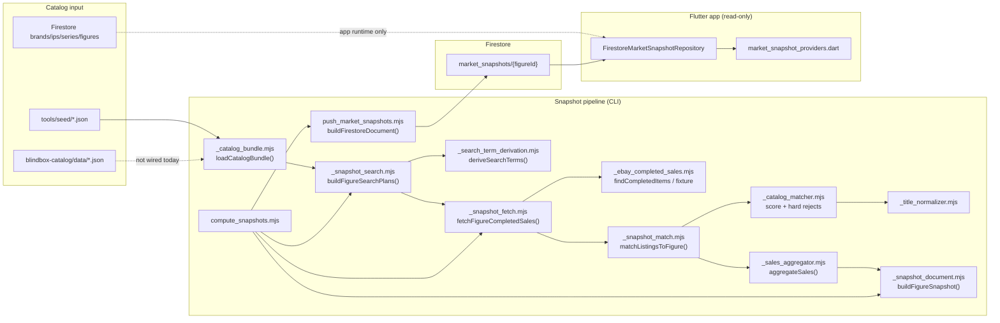
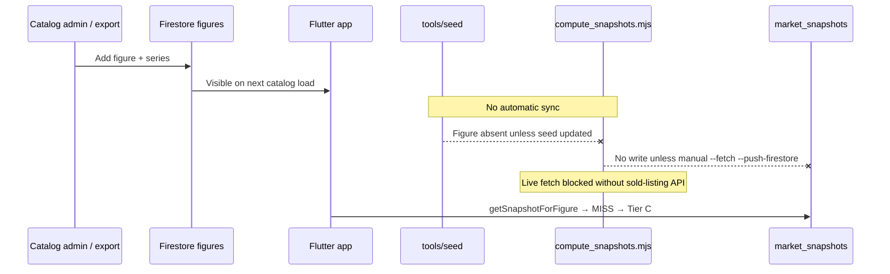

# Sprint 3N-C — Market Snapshot Pipeline Forensics

**Date:** 2026-06-16  
**Scope:** Root-cause investigation — why production `market_snapshots` coverage is ~0.07% (1/1,457 figures).  
**Method:** Code trace, production Firestore reads, `blindbox-catalog/data` export comparison, pipeline execution (`fixture` full-catalog run, search-plan forensics).  
**App consumption:** Confirmed not the problem (`marketSnapshotProvider` reads Firestore correctly).

---

## Executive answer

There are only **2** `market_snapshots` documents because **no production-scale snapshot pipeline run has ever written to Firestore**. The **only** writer that has executed against production is the **dev validation seeder** (`push_market_snapshots_dev.mjs`), which pushed **2 hand-authored mock documents** on 2026-06-15 ([`FIRESTORE_E2E_VALIDATION_REPORT.md`](./FIRESTORE_E2E_VALIDATION_REPORT.md)).

The eBay → matcher → snapshot → Firestore path is **implemented** but **never operated** at catalog scale. Even if it were run today, three independent blockers would still cap coverage near zero:

1. **No sold-listing data source in production** — Finding API `findCompletedItems` is decommissioned; Marketplace Insights not granted ([`SOLD_LISTING_DATA_SOURCE.md`](./SOLD_LISTING_DATA_SOURCE.md), [`docs/TECH_DEBT.md`](../../docs/TECH_DEBT.md)).
2. **Pipeline catalog ≠ production catalog** — `loadCatalogBundle()` reads `tools/seed/` (1,144 figures), not Firestore (1,455 figures). **311 figures and 45 series** (including all 18 non-blind-box SKUs) are invisible to the default CLI.
3. **No scheduler** — manual CLI only; nothing triggers `compute_snapshots --fetch --push-firestore`.

Matcher strictness is a **secondary** factor: on a full-catalog **fixture** run, only **14.1%** (161/1,144) of seed figures produce a Firestore-writable median. That does **not** explain 2 documents — it would explain depressed coverage **after** a pipeline run.

**To reach hundreds of snapshots:** wire the pipeline to the production catalog export, obtain a working sold-listing API, run `compute_snapshots.mjs --fetch --push-firestore` across the catalog (or phased batches), and deploy a scheduler.

---

## Part 1 — Architecture trace

### Pipeline diagram



### Entry points and operational model

| Kind | Artifact | Role |
|------|----------|------|
| **Production orchestrator** | `tools/market_intel/compute_snapshots.mjs` | CLI: search plans → fetch → `buildFigureSnapshot` → optional `--push-firestore` |
| **Production Firestore writer** | `tools/market_intel/push_market_snapshots.mjs` | `buildFirestoreDocument()` + `pushSnapshotsToFirestore()` |
| **Dev Firestore seeder** | `tools/market_intel/push_market_snapshots_dev.mjs` | Writes `market_snapshots_dev.seed.json` — **source of the 2 live docs** |
| **Validation / audit** | `snapshot_validation_audit.mjs`, `_catalog_coverage_audit.mjs`, `catalog_coverage_audit.mjs` | Read-only matcher/search coverage reports |
| **eBay probe** | `debug_ebay_live_probe.mjs` | Live API capability check |
| **Scheduled jobs** | — | **None in repo** (`docs/TECH_DEBT.md` § Snapshot Scheduler) |
| **Cloud Functions** | `functions/src/index.ts` | **Browse/active listings gateway only** — not snapshot generation |

### Firestore collections (production `blindbox-collection`)

| Collection | Snapshot-related? |
|------------|-------------------|
| `market_snapshots` | **Yes** — sole pricing/snapshot store |
| `brands`, `ips`, `series`, `figures` | Catalog (app + export source) |
| `official_feed_items` | Unrelated |

Repo search for `snapshot_results`, `market_data`, alternate pricing collections: **no writers found**.

### Code file inventory (pipeline order)

| Stage | Files |
|-------|-------|
| Catalog load | `_catalog_bundle.mjs`, `tools/seed/*.json`, `market_metadata.json` |
| Search plans | `_snapshot_search.mjs`, `_search_term_derivation.mjs` |
| eBay fetch | `_snapshot_fetch.mjs`, `_ebay_completed_sales.mjs`, `_ebay_env.mjs` |
| Matching | `_snapshot_match.mjs`, `_catalog_matcher.mjs`, `_title_normalizer.mjs` |
| Aggregation | `_sales_aggregator.mjs` |
| Snapshot doc | `_snapshot_document.mjs` |
| Orchestration | `compute_snapshots.mjs` |
| Firestore write | `push_market_snapshots.mjs` |
| Dev seeder | `push_market_snapshots_dev.mjs`, `market_snapshots_dev.seed.json` |
| App read | `lib/features/market_intel/data/firestore/firestore_market_snapshot_repository.dart`, `market_snapshot_providers.dart` |

---

## Part 2 — Catalog source audit

### Q1: What does `compute_snapshots.mjs` read?

**`tools/seed/*.json` only** — not Firestore, not `blindbox-catalog/data` unless manually synced.

```85:93:tools/market_intel/_catalog_bundle.mjs
export function loadCatalogBundle(repoRoot = defaultRepoRoot) {
  const figures = loadJsonFromRepo(repoRoot, 'tools/seed/figures.json');
  const series = loadJsonFromRepo(repoRoot, 'tools/seed/series.json');
  const brands = loadJsonFromRepo(repoRoot, 'tools/seed/brands.json');
  const ips = loadJsonFromRepo(repoRoot, 'tools/seed/ips.json');
  const metadata = loadJsonFromRepo(
    repoRoot,
    'tools/market_intel/market_metadata.json',
  );
```

The Flutter app loads catalog from Firestore via `loadFirestoreCatalogBundle()` → `CatalogBundleCache`. **Two divergent catalog universes.**

### Q2: Why 1,457 Firestore figures vs ~1,144 pipeline figures?

| Source | Figures | Series |
|--------|--------:|-------:|
| Production Firestore (2026-06-16) | 1,457 | 154 |
| `blindbox-catalog/data` export | 1,455 | 154 |
| `tools/seed` (pipeline default) | 1,144 | 109 |
| **In production, missing from seed** | **311** | **45** |

**Root cause:** `tools/seed` is a **stale subset** of the production catalog. New series are added to Firestore / catalog export but **not automatically synced** into `tools/seed`. There is no CI step or script in the default pipeline path that refreshes seed from Firestore.

### Q3: Quantified gaps

| Metric | Count |
|--------|------:|
| Figures in production export, absent from seed | 311 |
| Series in production export, absent from seed | 45 |
| Non-blind-box series missing from seed | 18 (all 18 production non-blind-box series) |

**Examples of missing series** (all `isBlindBox: false` unless noted):

- `the_monsters_mini_zimomo_maia`
- `mega_crybaby_400_crying_in_pink`
- `mega_space_molly_400_ashley_wood`
- `hirono_behind_time_figure`
- Plus 41 additional blind-box series (e.g. `smiski_museum_series`, `haikyuu_off_court_vibes_series_figures`)

### Q4: Can newly added production catalog items enter the pipeline?

**Not with default CLI.** A figure added to Firestore tomorrow:

1. Appears in the app immediately (Firestore catalog path).
2. Does **not** appear in `loadCatalogBundle()` until `tools/seed/figures.json` is updated (or bundle loader is changed).
3. `compute_snapshots.mjs --figure <new_id>` → **exit 1**: *"No figures matched the requested filters."*

**Evidence:** `mini_zimomo` and `mega_crybaby` exist in production Firestore but fail `--figure` filter against seed ([`MARKET_COVERAGE_GAP_AUDIT.md`](./MARKET_COVERAGE_GAP_AUDIT.md)).

---

## Part 3 — Search plan generation

Measured with `_sprint_3nc_catalog_forensics.mjs` against **production export** (`blindbox-catalog/data`).

### Production catalog (1,455 figures)

| Metric | Count |
|--------|------:|
| Total figures | 1,455 |
| Active search plans | 1,448 |
| `DISABLED` (metadata) | 0 |
| `NO_SEARCH_TERMS` | 7 |

### Rejection: `NO_SEARCH_TERMS` (7 figures)

| Reason | Code location | Mechanism |
|--------|---------------|-----------|
| Empty `deriveSearchTerms()` result | `_snapshot_search.mjs:57-58` | `searchTerms.length === 0` |
| `extractSeriesDistinctive()` empty after boilerplate strip | `_search_term_derivation.mjs:199-200` | `!seriesDistinctive` → `[]` |
| Missing brand/IP/series displayName | `_search_term_derivation.mjs:191-192` | early `[]` |

**All 7 examples:** Smiski Series 2 (`smiski_series_2_*`) — series distinctive collapses to empty after stripping "Series 2" boilerplate (documented in `docs/TECH_DEBT.md` § Catalog Metadata Quality Audit).

### Seed catalog (1,144 figures)

| Active plans | 1,137 |
| `NO_SEARCH_TERMS` | 7 (same Smiski Series 2) |

### Mega / 400% / non-blind-box

| Question | Answer | Evidence |
|----------|--------|----------|
| Mega / 400% / 1000% figures generate plans? | **Yes** (when in catalog export) | e.g. `space_molly_mega_100_series_2_b_meilin_panda` → 2 terms; `mega_crybaby_400_*` in prod export |
| Non-blind-box figures generate plans? | **Yes** — 18/18 active in prod export | All 18 `isBlindBox: false` series missing from **seed** but plan-active in **prod export** |
| Intentionally excluded by code? | **No** — no `isBlindBox` gate in `_snapshot_search.mjs` or `deriveSearchTerms()` | Exclusion is **catalog absence from seed**, not product-type policy |

`market_metadata.json` contains **1** figure override (Lucky / Big Into Energy) — **not** a global allowlist.

---

## Part 4 — eBay acquisition audit

### Capability

| Stage | Would execute (prod catalog) | Executes today | Blocker |
|-------|------------------------------:|---------------:|---------|
| Search term → HTTP request | ~1,448 figures × ~2 queries ≈ **2,896 queries** | **0** at catalog scale | Pipeline never run |
| Live `findCompletedItems` | Implemented in `_ebay_completed_sales.mjs` | **Blocked** | Finding API decommissioned ([`SOLD_LISTING_DATA_SOURCE.md`](./SOLD_LISTING_DATA_SOURCE.md)) |
| Fixture mode | Works | Dev/audit only | Synthetic data, not production |
| OAuth credentials | `EBAY_CLIENT_ID` / `EBAY_CLIENT_SECRET` in `functions/.env.blindbox-collection` | Present | Credentials work; **sold-listing endpoint unavailable** |
| Default fetch mode | `live` (`_ebay_env.mjs`) | Exits without `EBAY_CLIENT_ID` | `compute_snapshots.mjs:276-280` |

### Fixture full-catalog execution (evidence pipeline *can* reach fetch stage)

```
node tools/market_intel/_fixture_full_catalog_count.mjs
```

| Metric | Value |
|--------|------:|
| Figures fetched (seed catalog) | 1,137 |
| Successful queries | 100% (fixture) |
| Failed queries | 0 |

**Conclusion:** The pipeline **can** execute fetch → match → aggregate when invoked. Production Firestore emptiness is **not** caused by fetch code being disabled in source — it is caused by **never running** the orchestrator with `--push-firestore`, and **live sold data being platform-blocked**.

---

## Part 5 — Match pipeline audit

### Confidence scoring and thresholds (code)

| Rule | Value | File |
|------|-------|------|
| Match acceptance threshold | `DEFAULT_MATCH_THRESHOLD = 0.75` | `_catalog_matcher.mjs:14` |
| High vs low snapshot confidence | `sampleSize >= 5` → high | `_snapshot_document.mjs:18` |
| Minimum sales to **create** snapshot | **None** — 1 match suffices | `buildSnapshotDocument()` |
| Minimum sales to **write** Firestore | `medianPrice != null && > 0` | `push_market_snapshots.mjs:66-68` |
| Hard rejects | Product-type tiers, weak identity + accessory terms, conflicting series phrases | `_catalog_matcher.mjs` |
| Title normalization | `structurallyNormalizeTitle()` | `_title_normalizer.mjs` |
| Brand / series / figure scoring weights | 0.15 / 0.30 / 0.40 (+ partial series 0.15) | `_catalog_matcher.mjs:17-24` |

### Measured outcomes — full seed catalog, fixture mode

Run: `_fixture_full_catalog_count.mjs` (2026-06-16).

| Bucket | Count | % of 1,144 figures |
|--------|------:|-------------------:|
| Skipped at search plan | 7 | 0.6% |
| Fetched, **median null** (no writable snapshot) | 976 | 85.3% |
| **Writable** figure snapshots | 161 | **14.1%** |
| High confidence (≥5 sales) | 0 | 0% |
| Low confidence (<5 sales) | 161 | 14.1% |

Fixture listings for most figures use generic titles (`{query} - sold listing sample A`). The matcher still rejects **~86%** — strict identity/brand/series gates, not search-plan failure.

### Curated 15-figure validation sample

[`SNAPSHOT_VALIDATION_REPORT.md`](./SNAPSHOT_VALIDATION_REPORT.md) (fixture, hand-picked figures):

| Status | Count |
|--------|------:|
| PASS (writable Firestore payload) | 9 |
| WARNING | 5 |
| FAIL | 1 |
| Skipped at Firestore mapping (null median) | 6 |

### Q: Is matching so strict coverage naturally collapses to ~0%?

**After a pipeline run with real listings:** matcher strictness would cap coverage **well below 100%** — fixture evidence suggests **~14–60%** depending on listing title quality (14% generic fixture, 60% curated validation sample).

**That is not why Firestore has 2 documents.** Matcher strictness explains **lost yield after fetch**; the current **~0.07%** is explained by **pipeline never run + dev seeder only**.

### Hypothetical full-catalog run today (prod export, if live sold data worked)

| Scenario | Estimated writable figure snapshots |
|----------|-------------------------------------:|
| Curated-quality listings (~60% pass rate) | ~870 / 1,448 |
| Generic/low-quality titles (~14% pass rate) | ~200 / 1,448 |
| **Current Firestore** | **1** figure-level doc from dev seed |

---

## Part 6 — Snapshot generation audit

### `buildFigureSnapshot()` conditions

```78:92:tools/market_intel/_snapshot_document.mjs
export function buildFigureSnapshot(
  listings,
  figure,
  catalogBundle,
  metadata = {},
) {
  const matchResult = matchListingsToFigure(listings, figure, catalogBundle);
  const aggregation = aggregateSales(matchResult.matchedListings);
  const document = buildSnapshotDocument(figure, aggregation, metadata);
  // ...
}
```

- **Always** produces an in-memory `SnapshotDocument` (sampleSize may be 0).
- **Firestore write** only when `buildFirestoreDocument()` passes (median > 0).

### Q1: How many snapshots if pipeline ran successfully today?

| Mode | Writable figure snapshots |
|------|--------------------------:|
| Fixture, full **seed** catalog | **161** (measured) |
| Fixture, full **prod** catalog (extrapolated ~14%) | **~200** |
| Live eBay (unknown match rate) | **~200–870** (bounded by Part 5) |

### Q2: Are snapshots discarded after generation?

**Yes, at Firestore mapping** — not in `buildFigureSnapshot()`:

- `medianPrice == null` or `<= 0` → skip (`push_market_snapshots.mjs:66-68`)
- On fixture full run: **976** snapshots generated in-memory with null median → **discarded at push**

### Q3: Is snapshot generation disabled?

**No.** `compute_snapshots.mjs` builds snapshots for every non-skipped fetch (`lines 336-346`). Generation is disabled only when `--dry-run` or fetch skip.

### Q4: Are only dev fixtures being generated?

**In Firestore: yes.** The 2 documents are **hand-authored** in `market_snapshots_dev.seed.json` with `trend: "rising"` / `"stable"` (production mapper always writes `trend: "unknown"`). They cannot have originated from `push_market_snapshots.mjs`.

---

## Part 7 — Firestore write audit

### Q1: Which code path produced the existing 2 documents?

**`push_market_snapshots_dev.mjs`** reading `market_snapshots_dev.seed.json`.

Documented in [`FIRESTORE_E2E_VALIDATION_REPORT.md`](./FIRESTORE_E2E_VALIDATION_REPORT.md) — executed **2026-06-15**:

| Document ID | Level |
|-------------|-------|
| `the_monsters_big_into_energy_vinyl_plush_pendant_luck` | figure |
| `the_monsters_big_into_energy_vinyl_plush_pendant` | series |

Note: `compute_snapshots.mjs` + `push_market_snapshots.mjs` only write **`level: "figure"`** documents. The **series-level** doc was written **only** by the dev seeder (for Tier B UI validation).

### Q2: Is there a production writer?

**Yes** — `push_market_snapshots.mjs` / `pushSnapshotsToFirestore()`.

### Q3: Has it ever been executed against production?

**No evidence of catalog-scale execution.** E2E validation used the **dev** seeder. Unit tests cover `buildFirestoreDocument()` mapping only.

### Q4: Are snapshots written elsewhere?

**No.** Single collection `market_snapshots`. App reads only this collection.

---

## Part 8 — Operational model audit

### Intended long-term architecture (from design docs)

| Model | Designed? | Implemented? | Gap |
|-------|-----------|--------------|-----|
| **A. Manual CLI scripts** | Yes | **Yes** — current state | Used for dev/audit only |
| **B. Scheduled batch jobs** | Yes (`TECH_DEBT`, `PRODUCTION_READINESS_AUDIT`) | **No** | No Cloud Scheduler / GitHub Action |
| **C. Admin-triggered jobs** | Implied | **No** | No admin UI |
| **D. Cloud Functions** | Browse gateway only | Partial | No snapshot function |

### Lifecycle: new figure added to catalog tomorrow



**Nothing in this chain runs automatically today.**

---

## Part 9 — Root cause summary (ranked)

| Rank | Root cause | Impact | Key files | Est. coverage gain if fixed |
|------|------------|--------|-----------|----------------------------|
| **P0** | **Production pipeline never executed** with `--fetch --push-firestore` at catalog scale | Firestore stuck at 2 dev docs | `compute_snapshots.mjs`, `push_market_snapshots.mjs` | **+150–850 figure docs** (depends on match yield) |
| **P0** | **No production sold-listing source** (Finding API dead, Insights not granted) | Live fetch cannot populate real sales | `_ebay_completed_sales.mjs`, `SOLD_LISTING_DATA_SOURCE.md` | **Prerequisite** for real market data |
| **P0** | **Pipeline reads stale `tools/seed`**, not Firestore/export | 311 figures (100% of non-blind-box) never enter pipeline | `_catalog_bundle.mjs` | **+45 series / +311 figures** eligible |
| **P1** | **No scheduler / automation** | Zero unattended refresh | `docs/TECH_DEBT.md` | Sustains coverage over time |
| **P2** | **Matcher + median gate** drops ~40–86% of fetched figures | Low yield per run even when pipeline executes | `_catalog_matcher.mjs`, `push_market_snapshots.mjs` | Tune thresholds/metadata after live pilot |
| **P3** | **No series snapshot generation in production writer** | Tier B fallback requires manual series docs | `push_market_snapshots.mjs` (figure-only) | +series-level fallbacks where figure miss |
| **P4** | **7 Smiski Series 2 figures** — `NO_SEARCH_TERMS` | 7 figures unreachable | `_search_term_derivation.mjs` | +7 figures |
| **P4** | **`market_metadata.json` barely used** (1 figure) | No per-SKU tuning at scale | `market_metadata.json` | Quality/coverage tuning |

---

## Part 10 — Recommended next sprint

### Objective

**Increase valid `market_snapshots` documents in production Firestore** — not UI, not disclosure copy.

### Smallest high-impact change (3N-D proposal)

**Sprint 3N-D: Production catalog wiring + sold-listing unblock pilot**

1. **Wire catalog input to production export**  
   - Add `CATALOG_DATA_DIR` env to `loadCatalogBundle()` (default: `../blindbox-catalog/data` or Firestore export script).  
   - One-time sync job: export Firestore → pipeline input on catalog change.  
   - **Fixes P0 catalog split** — all 1,455 figures become addressable.

2. **Unblock sold listings (parallel track)**  
   - Pursue Marketplace Insights approval **or** evaluate third-party sold-data provider.  
   - Until granted: run **pilot** on 1–3 series with best metadata (e.g. Big Into Energy, Have a Seat) using whatever sold source is available.  
   - **Fixes P0 data source.**

3. **Execute first production write**  
   ```bash
   # After catalog wiring + sold source confirmed:
   node tools/market_intel/compute_snapshots.mjs --fetch --push-firestore --series big_into_energy
   # Then phased full catalog with --limit batches
   ```
   - **Fixes P0 operational gap.**

4. **Add weekly GitHub Action** (minimal scheduler) to re-run pipeline — **fixes P1**.

### Expected coverage after fix

| Milestone | Figure snapshots (est.) | Notes |
|-----------|------------------------:|-------|
| Today | 1 figure (+ 1 series dev doc) | Dev seeder only |
| After catalog wiring + fixture push (not recommended for prod users) | ~200 | Synthetic prices |
| After catalog wiring + **live** pilot (conservative 14% yield) | **~200** | Match strictness |
| After catalog wiring + live pilot (validation-like 60% yield) | **~870** | Optimistic with good titles |
| After metadata enrichment + matcher tuning | **900+** | Smiski + borderline series |

**Realistic first production target:** **150–300 figure snapshots** from a phased pilot (10–20 high-volume series), then expand.

### Explicit non-goals for 3N-D

- Tier B wording / disclosure sheets (already shipped in 3M)
- Disabling series fallback for Mega (separate trust sprint)
- App-side changes (read path is correct)

---

## Appendix — Forensics artifacts

| Artifact | Purpose |
|----------|---------|
| `_sprint_3nc_catalog_forensics.mjs` | Prod vs seed search-plan counts |
| `_fixture_full_catalog_count.mjs` | Full-catalog fixture writable count |
| `MARKET_COVERAGE_GAP_AUDIT.md` | Sprint 3N-B gap summary |
| `FIRESTORE_E2E_VALIDATION_REPORT.md` | Proof dev seeder wrote 2 docs |
| `snapshot_validation_report.json` | 15-figure matcher validation |

### Reproduce key measurements

```bash
# Search plans on production export
node tools/market_intel/_sprint_3nc_catalog_forensics.mjs

# Full seed catalog fixture writables (~7 min)
node tools/market_intel/_fixture_full_catalog_count.mjs

# Dry-run search terms (seed)
node tools/market_intel/compute_snapshots.mjs --dry-run --limit 5
```

---

## Bottom line

**Why only 2 snapshots?** Because Firestore was populated **once** by a **dev mock seeder** for UI validation, and the **real eBay snapshot pipeline has never been operated** against the production catalog or written to Firestore at scale.

**What must happen for hundreds of snapshots?**

1. Point the pipeline at the **production catalog** (not stale seed).  
2. Obtain a **working sold-listing API**.  
3. **Run** `compute_snapshots.mjs --fetch --push-firestore` (phased, then full).  
4. **Schedule** recurring runs.

Matcher strictness will keep coverage below 100% — that is intentional (**Trust > Coverage**) — but it cannot explain **0.07%**. Operations and catalog wiring explain that.
